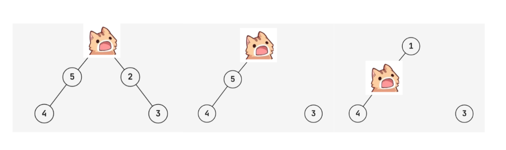
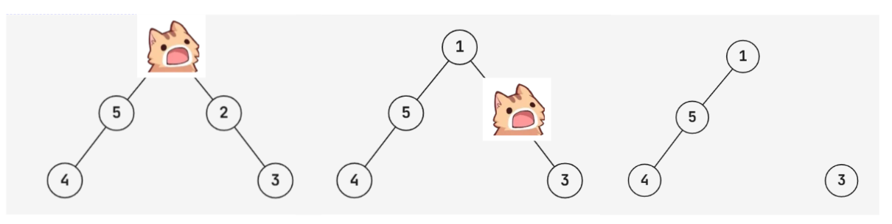

# D. Catshock

**time limit per test:** 2 seconds

**memory limit per test:** 256 megabytes

**input:** standard input

**output:** standard output

A cat lives on a tree with $n$ nodes. The cat starts on node $1$, and you live on node $n$. You are going to leave the cat a note written in the parkour language to help it reach you.

The parkour language has two types of instructions:

- $1$ — This means that the cat should move to any adjacent node to it, if there are multiple options, it will pick one of them arbitrarily. If there are no adjacent nodes to it, then it will not move.
- $2\,u$ — This means to destroy node $u$ and all adjacent edges to it. If the cat is currently on node $u$, it will die, so this should be avoided. If node $u$ was already destroyed, then nothing will happen.

Additionally, there cannot be two consecutive instances of the second instruction.

Unfortunately, the parkour language is ambiguous because the cat may have multiple options for each instance of the first instruction. So you should construct a sequence of instructions of length at most $3n$ so that if the cat follows them, it will end at node $n$, no matter what choices it makes. It can be proven that such a sequence exists for any tree.

#### Input

Each test contains multiple test cases. The first line contains the number of test cases $t$ ($1 \le t \le 10^4$). The description of the test cases follows.

The first line of each testcase contains an integer $n$ ($2 \le n \le 2 \cdot 10^5$) — the size of the tree.

Then $n - 1$ lines follow, each of them contains two integers $u$ and $v$ ($1 \le u,v \le n, u \ne v$) which describe a pair of vertices connected by an edge. It is guaranteed that the given graph is a tree and has no loops or multiple edges.

The sum of $n$ across all testcases does not exceed $2 \cdot 10^5$.

#### Output

For each testcase, output a single integer $k$ ($0 \le k \le 3n$) — the number of operations you will perform.

Then output $k$ lines of either of the following formats:

- $1$ — make the cat move to an adjacent node if there are nodes adjacent to it.
- $2\,u$ ($1 \le u \le n$) — delete node $u$ along with all adjacent edges

#### Example

#### Input
```
4
5
1 2
2 3
1 5
5 4
2
1 2
4
1 2
1 3
1 4
6
1 2
1 3
3 4
4 5
4 6
```

#### Output
```
2
2 2
1

1
1

5
2 2
1
1
2 3
1

9
2 2
1
2 1
1
2 3
1
1
2 5
1
```

#### Note

There are extra spaces between the output of different test cases only for clarity, and the participants are not expected to print them.

The path of the cat in the first testcase is shown below.





It can be shown that this is the only possible path, and so the cat will always end at node $5$.

An example of a sequence of instructions that does not work for the first testcase is: $\mathtt{1}$, $\mathtt{2}$ $\mathtt{2}$. As the following may happen:





Here the cat died at node $2$.
