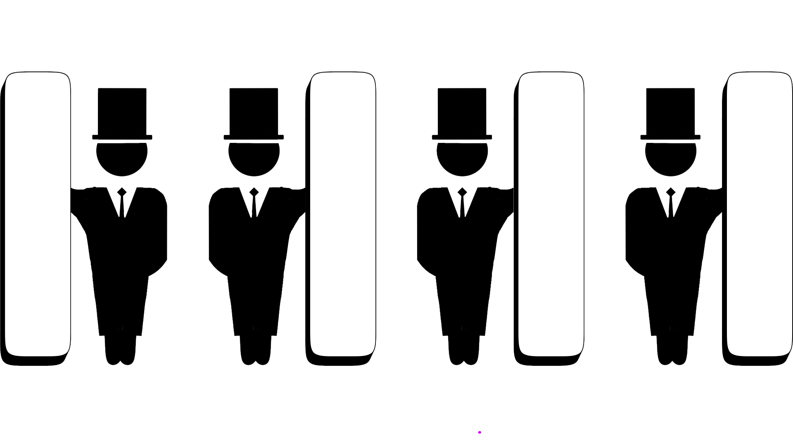

# C. The Ancient Wizards' Capes

**time limit per test:** 2 seconds

**memory limit per test:** 256 megabytes

**input:** standard input

**output:** standard output


There are $n$ wizards in a row numbered $1$ to $n$ from left to right. Each wizard has an invisibility cape which can be worn either on his left side or on his right side. Harry walks from the position of wizard $1$ until the position of wizard $n$ ($1 \le n \le 10^5$), and registers how many wizards he sees from each wizard's position. A wizard in position $j$ is visible from position $i$ if:


- Wizard $j$ wears his cape on his left side and $i \ge j$.
- Wizard $j$ wears his cape on his right side and $i \le j$.

In particular, note that wizard $i$ is visible from position $i$.

Harry's list is very old but, after much work, you managed to decipher it. The list is an array $a$ of $n$ elements, where the $i$-th element $a_i$ ($1 \le a_i \le n$) is the number of wizards that Harry saw from the position of wizard $i$.

Your task is to determine how many of all the possible cape arrangements that Harry could have seen are consistent with the data recorded by the list, modulo $676\,767\,677$.

#### Input

Each test contains multiple test cases. The first line contains the number of test cases $t$ ($1 \le t \le 10^4$). The description of the test cases follows.

The first line of each test case contains a single integer $n$ ($1 \le n \le 10^5$) — the length of $a$.

The second line contains $n$ integers $a_1, a_2, \ldots, a_n$ ($1 \le a_i \le n$) — the elements of $a$.

It is guaranteed that the sum of $n$ over all test cases does not exceed $10^5$.

#### Output

For each test case, print one integer — the number of arrangements for the wizards' capes that satisfy the condition, modulo $676\,767\,677$.

#### Example

#### Input
```
7
1
1
4
4 4 3 2
3
1 3 2
2
2 1
3
2 2 2
3
3 2 3
3
3 2 2
```

#### Output
```
2
1
0
1
2
0
0
```

#### Note

The image below shows an arrangement of capes that matches Harry's list in the second test case.





Wizard 1 has the invisibility cape on his left side, while wizards $2$, $3$, and $4$ wear it on their right side.

- From position $1$, we can see wizards $1$, $2$, $3$, and $4$.
- From position $2$, we can see wizards $1$, $2$, $3$, and $4$.
- From position $3$, we can see wizards $1$, $3$, and $4$.
- From position $4$, we can see wizards $1$ and $4$.

Thus, Harry's list ends up being $[4, 4, 3, 2]$. It can be proved that this is the only possible arrangement.

In the third test case, it can be proved that Harry could not have obtained his list from any cape arrangement.

In the fifth case, note that there are two possible cape arrangements from which Harry could have gotten his list:

- $1 \mid \quad \mid 2 \quad 3 \, \mid$
- $\mid \, 1 \quad 2 \mid \quad \mid 3$
