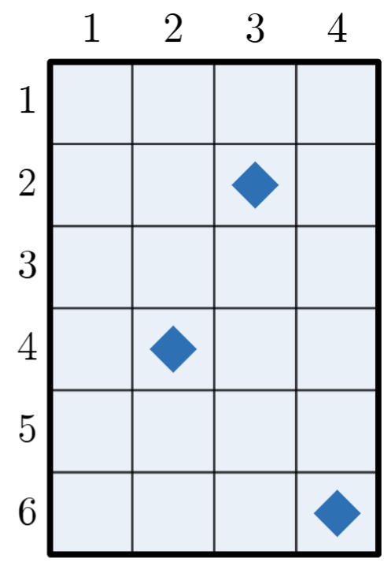
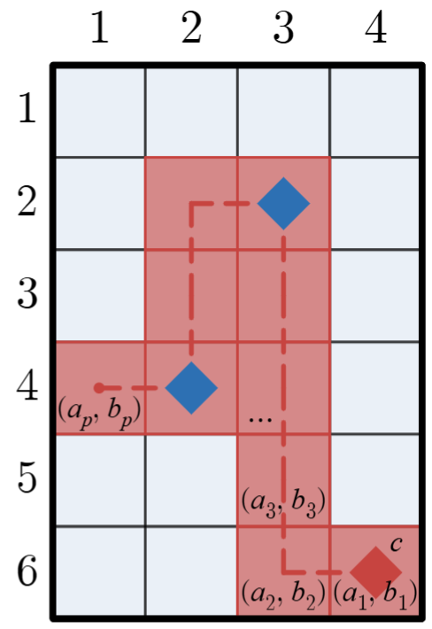
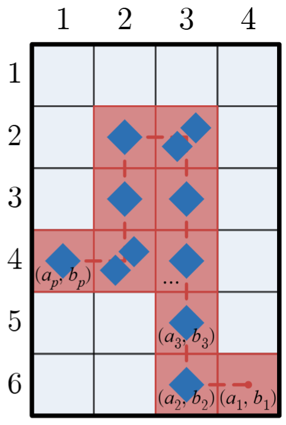
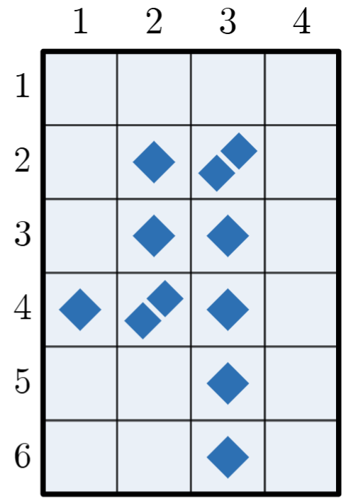

# E. Mimo & Yuyu

**time limit per test:** 2 seconds

**memory limit per test:** 256 megabytes

**input:** standard input

**output:** standard output


Mimo and Yuyu just finished their 1000-piece jigsaw puzzle of beautiful Bellas Artes! Now they are looking for other ways to entertain themselves.

There is an $n \times m$ grid of cells with columns labeled $1, 2, \ldots m$ from left to right and rows labeled $1, 2, \ldots n$ from top to bottom. Let $(u, v)$ ($1 \le u \le n, 1 \le v \le m$) denote the cell in the $u$-th row and $v$-th column. Each cell can contain any number of tokens which are indistinguishable among themselves. Initially, there are $k$ tokens, the $i$-th of which is located in $(x_i, y_i)$.

Mimo and Yuyu now play a game alternating turns. On his/her turn, a player chooses a token $c$ currently in the grid as well as a sequence of distinct cells $(a_1, b_1), (a_2, b_2), \ldots (a_p, b_p)$ ($p \ge 2$) such that the following conditions hold:

- $c$ is located in $(a_1, b_1)$
- For all $i$ ($1 \le i \lt p$), $\left|a_{i+1} - a_i\right|+\left|b_{i+1} - b_i\right| = 1$. That is, adjacent cells in the sequence must be adjacent in the grid.
- $b_1 \ge b_2 \ge \ldots \ge b_p$. That is, the columns of the cells of the sequence must form a non-increasing sequence (never stepping away from column $1$).
- $b_p = 1$. That is, the last cell of the sequence must lie in column $1$.
- $b_1 \gt b_2$. In particular, $b_2 = b_1-1$. That is, $(a_1, b_1)$ must be the only cell of the sequence lying in column $b_1$.

Then, he/she removes $c$ from the grid and adds 1 token to $(a_2, b_2), (a_3, b_3), \ldots (a_p, b_p)$ each. This concludes his/her turn.

The player who cannot make a turn loses. Mimo goes first. Determine who will win if both players play optimally.

For example, consider a game where $n=6$, $m=4$, and 3 tokens currently exist in $(2, 3)$, $(4, 2)$, and $(6, 4)$ (as shown in Figure 1). In this scenario, a valid turn, for instance, could consist of choosing $c$ as the token in $(6, 4)$ and the sequence of cells with $p=10$ defined by $a=[6,6,5,4,3,2,2,3,4,4]$ and $b=[4,3,3,3,3,3,2,2,2,1]$. Note that $(a_i, b_i)$ describes valid cells in the grid.

For the sake of clarity, a dashed line is shown in Figure 2 passing through this particular choice of $(a_1, b_1), (a_2, b_2), \ldots (a_p, b_p)$ in order. Figure 3 and 4 show the state of the game after the turn is performed, with and without the highlighted sequence respectively.






Figure 1Figure 2





Figure 3Figure 4
Note that the first and seventh test case in the example correspond to the games shown in Figure 1 and Figure 4 respectively.

#### Input

Each test contains multiple test cases. The first line contains the number of test cases $t$ ($1 \le t \le 10^4$). The description of the test cases follows.

The first line of each test case contains three integers $n$, $m$, and $k$ ($1 \le n, m, k \le 2 \cdot 10^5$).

The $i$-th of the next $k$ lines contains two integers $x_i$ and $y_i$ ($1 \le x_i \le n, 1 \le y_i \le m$).

It is guaranteed that the sum of $k$ over all test cases does not exceed $2 \cdot 10^5$.

Note that there is no explicit upper bound on the sum of $n$ and $m$.

#### Output

For each test case, output Mimo if Mimo wins, or Yuyu if Yuyu wins.

You can output the answer in any case (upper or lower). For example, the strings mIMo, mimo, Mimo, and MIMO will be recognized as responses indicating that the first player wins.

#### Example

#### Input
```
7
6 4 3
2 3
4 2
6 4
1 1 1
1 1
3 2 4
1 1
1 2
2 2
3 2
20 4 3
10 4
20 2
1 3
1 5 1
1 3
2 3 5
2 1
1 2
1 2
2 3
1 3
6 4 11
6 3
5 3
4 3
3 3
2 3
2 3
2 2
3 2
4 2
4 2
4 1
```

#### Output
```
Mimo
Yuyu
Mimo
Mimo
Yuyu
Yuyu
Yuyu
```

#### Note

In the second test case, Mimo cannot make any moves, so Yuyu wins.

In the third test case, the token in $(1, 1)$ cannot be used as $c$ for any turn because there is no sequence of cells that begins with $(1, 1)$ and satisfies $b_1 \gt b_2$, so the game might unfold as follows:

- Mimo removes the token in $(1, 2)$ and adds a token to $(1, 1)$.
- Yuyu removes the token in $(2, 2)$ and adds a token to $(2, 1)$.
- Mimo removes the token in $(3, 2)$ and adds a token to $(3, 1)$.

It can be shown that Yuyu could not have played more optimally, so Mimo wins.
