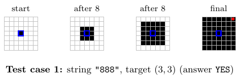
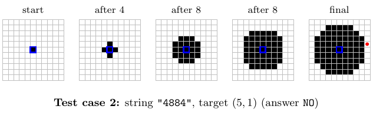
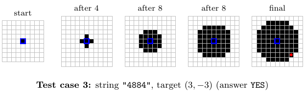

# B. Expansion Plan 2

**time limit per test:** 1 second

**memory limit per test:** 256 megabytes

**input:** standard input

**output:** standard output

[ak+q - over the crimson skies](<https://soundcloud.com/umbracollective/akq-over-the-crimson-skies>)

⠀

You are analyzing an infinite grid with coordinates $(X, Y)$ (specifically, the cell immediately above $(0, 0)$ is $(0, 1)$, and the cell immediately on the right of $(0, 0)$ is $(1, 0)$). Initially, only the cell at $(0, 0)$ is black.

You are given a string $a_1a_2 \ldots a_n$ of length $n$ consisting of characters $\texttt{"4"}$ and $\texttt{"8"}$, which describes $n$ expansion operations. For each $i$ from $1$ to $n$, the following happens for all cells simultaneously:

- if $s_i = \texttt{"4"}$: for each cell, if it is orthogonally adjacent to a black cell (i.e., it shares a side), it becomes black; otherwise, its state remains the same;
- if $s_i = \texttt{"8"}$: for each cell, if it is orthogonally or diagonally adjacent to a black cell (i.e, it shares a side or a corner), it becomes black; otherwise, its state remains the same.

Is the cell $(x, y)$ black at the end of the process?

#### Input

Each test contains multiple test cases. The first line contains the number of test cases $t$ ($1 \le t \le 10^4$). The description of the test cases follows.

The first line of each test case contains three integers $n$, $x$, $y$ ($1 \le n \le 2 \cdot 10^5, -10^9 \le x, y \le 10^9$) — the number of expansion operations, and the $x$ and $y$ coordinates of the cell you are interested in, respectively.

The second line of each test case contains a string $s$ of length $n$ consisting of characters $\texttt{"4"}$ and $\texttt{"8"}$ — the types of expansion operations.

It is guaranteed that the sum of $n$ over all test cases does not exceed $2 \cdot 10^5$.

#### Output

For each test case, output $\texttt{YES}$ if the cell $(x, y)$ is black after the expansion operations described by the string $s$, and $\texttt{NO}$ otherwise.

The judge is case-insensitive (for example, $\texttt{YES}$, $\texttt{Yes}$, $\texttt{yes}$, $\texttt{yEs}$ will all be recognized as positive answers).

#### Example

#### Input
```
6
3 3 3
888
4 5 1
4884
4 3 -3
4884
7 -7 -5
4884884
10 0 0
4884884888
1 1 1
4
```

#### Output
```
YES
NO
YES
NO
YES
NO
```

#### Note

The first three test cases are illustrated below:











In the first test case, after the expansion operations in the string $\texttt{"888"}$, cell $(3, 3)$ is black, so the answer is $\texttt{YES}$.

In the second test case, cell $(5, 1)$ is white after the expansion operations in the string $\texttt{"4884"}$.
