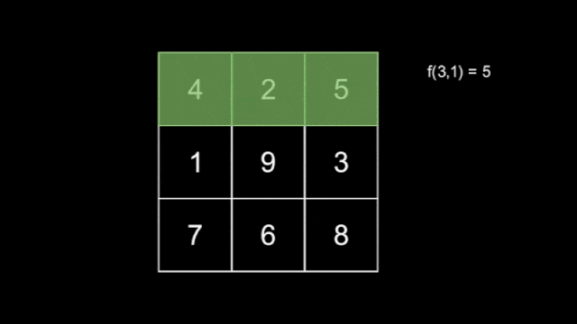
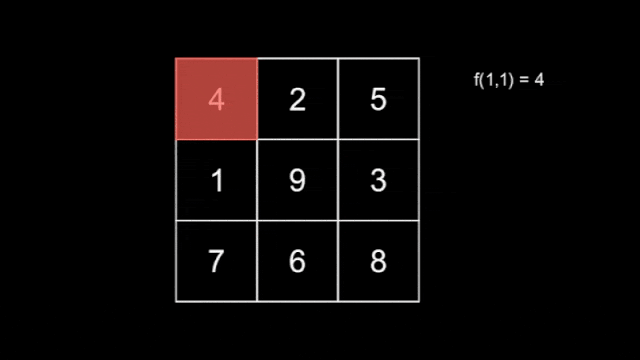
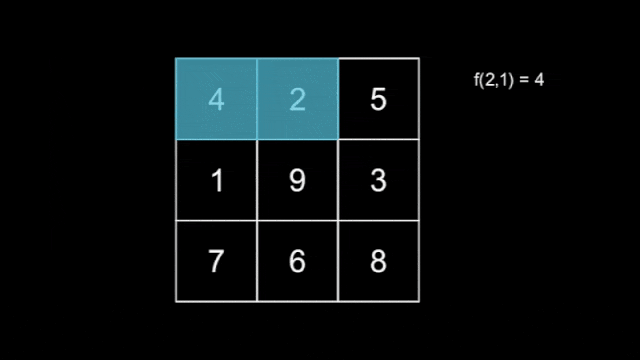

# F. Grand Finale: Snakes

**time limit per test:** 4 seconds

**memory limit per test:** 512 megabytes

**input:** standard input

**output:** standard output


This is an interactive problem.

You are given an integer $n$ and an $n\times n$ grid of numbers $G$. The grid of numbers contains each number from $1$ to $n^2$ exactly once.

Let's define a snake of length $l$ as a deque $[(x_1,y_1), (x_2,y_2), \ldots, (x_l,y_l)]$, where $(x_1,y_1)$ is the head of the snake, and $(x_l,y_l)$ is the tail. At second $1$, $x_1=x_2=\ldots = x_l=1$ and $y_i=i$ for all $1 \leq i \leq l$. In other words, the snake is entirely located in the first row, with the head at $(1,1)$ and the rest of the snake to the right of the head.

Each subsequent second, the snake moves down or right in the grid. Formally, the tail $(x_l,y_l)$ is removed, and either $(x_1+1,y_1)$ or $(x_1,y_1+1)$ is added as the new head. The first move of the snake is always downwards. It can be shown that the snake will never intersect itself under these restrictions. The snake will move exactly $2n-2$ times, never moving outside the grid. At second $2n-1$, the head reaches $(n,n)$, and the movement stops. It can be shown that the snake moves exactly $n-1$ times to the right and exactly $n-1$ times downwards.

There are $n$ hidden snakes, with the $i$-th snake having length $i$ for $1 \leq i \leq n$, each moving independently according to the rule above. You do not know how the snakes move. Define $f(l,T)$ as the maximum number that the snake with length $l$ covers at second $T$.




 An example of a snake with length $l=3$.
Now, you are also given an integer $m$. Your task is to find the $m$ smallest values of $f(l,T)$, using at most $120n+m$ queries asking for the value of $f(l,T)$ for some $1 \leq l \leq n$ and $1 \leq T \leq 2n-1$.

#### Input

Each test contains multiple test cases. The first line contains the number of test cases $t$ ($1 \le t \le 100$). The description of the test cases follows.

The first line of each test case contains two integers $n$ and $m$ ($2 \leq n \leq 500, 1 \leq m \leq n(2n-1)$).

The following $n$ lines contain the grid $G$. The $i$-th of these lines contains $n$ integers $G_{i,1}, G_{i,2}, \ldots, G_{i,n}$ ($1 \leq G_{i,j} \leq n^2$).

It is guaranteed that $G$ contains each number from $1$ to $n^2$ exactly once.

It is guaranteed that the sum of $n$ over all test cases does not exceed $500$, and the sum of $m$ over all test cases does not exceed $5\cdot 10^4$.

After you read the $n+1$ lines of input, the interaction begins with your first query.

#### Interaction

To make a query, output a line in the following format (without the quotes):

- "? $l\;T$" ($1 \leq l \leq n$, $1 \leq T \leq 2n-1$).

After each query, read in a single integer – the value of $f(l,T)$. You may ask at most $120n+m$ queries of this type.

When you are ready to output the answer, print a line in the following format:

- "! $S_1\;S_2\;S_3\;\ldots\;S_m$" ($1 \leq S_1 \leq S_2 \leq \ldots \leq S_m$).

This should contain the $m$ smallest values of $f(l,T)$ in non-decreasing order. Note that this does not count towards the query limit.

After this, proceed to the next test case, or exit if this is the last test case.

If you make more than $120n+m$ queries during an interaction, your program must terminate immediately, and you will receive the Wrong Answer verdict. Otherwise, you can get an arbitrary verdict because your solution will continue to read from a closed stream.

After printing each line, do not forget to output the end of line and flush the output buffer. Otherwise, you will receive the Idleness Limit Exceeded verdict. To flush, use:

- fflush(stdout) or cout.flush() in C++;
- System.out.flush() in Java;
- stdout.flush() in Python;
- see the documentation for other languages.

Hacks

To make a hack, please use the following format:

The first line should contain the number of test cases $t$ ($1 \leq t \leq 100$).

The first line of each test case should contain two integers $n$ and $m$ ($2 \leq n \leq 500, 1 \leq m \leq n(2n-1)$).

The following $n$ lines should each contain $n$ integers, giving information about the grid $G$. The $i$-th of these lines contains $n$ integers $G_{i,1}, G_{i,2}, \ldots, G_{i,n}$ ($1 \leq G_{i,j} \leq n^2$).

Afterwards, for each of the $n$ snakes in increasing length, output a string $s_l$ of length $2n-2$. The $i$-th letter of $s_l$ must denote the $i$-th move of the snake of length $l$, where 'R' denotes right and 'D' denotes downwards. For all $1 \le l \le n$, the first letter of $s_l$ must be 'D'.

For each $l$, the string $s_l$ must contain exactly $n-1$ 'R's and exactly $n-1$ 'D's.

The sum of $n$ over all test cases should not exceed $500$.

The sum of $m$ over all test cases should not exceed $5 \cdot 10^4$.

For example, the hack format corresponding to the example interaction is as follows.
```
1
3 15
4 2 5
1 9 3
7 6 8
DRDR
DDRR
DRRD
```

#### Example

#### Input
```
1
3 15
4 2 5
1 9 3
7 6 8

4

1

9

6

8

4

4

7

7

8

5

4

9

9

9
```

#### Output
```
? 1 1

? 1 2

? 1 3

? 1 4

? 1 5

? 2 1

? 2 2

? 2 3

? 2 4

? 2 5

? 3 1

? 3 2

? 3 3

? 3 4

? 3 5

! 1 4 4 4 4 5 6 7 7 8 8 9 9 9 9
```

#### Note

Below shows the tiles that the three snakes cover as they move across the grid.




 The tiles covered by the first snake.



 The tiles covered by the second snake.
The tiles covered by the third snake are shown in the statement above.
