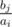

# A. Bicycle Chain

**time limit per test:** 2 seconds

**memory limit per test:** 256 megabytes

**input:** stdin

**output:** stdout

Vasya's bicycle chain drive consists of two parts: *n* stars are attached to the pedal axle, *m* stars are attached to the rear wheel axle. The chain helps to rotate the rear wheel by transmitting the pedal rotation.

We know that the *i*-th star on the pedal axle has *a*~*i*~ (0 < *a*~1~ < *a*~2~ < ... < *a*~*n*~) teeth, and the *j*-th star on the rear wheel axle has *b*~*j*~ (0 < *b*~1~ < *b*~2~ < ... < *b*~*m*~) teeth. Any pair (*i*, *j*) (1 ≤ *i* ≤ *n*; 1 ≤ *j* ≤ *m*) is called a gear and sets the indexes of stars to which the chain is currently attached. Gear (*i*, *j*) has a gear ratio, equal to the value


.

Since Vasya likes integers, he wants to find such gears (*i*, *j*), that their ratios are integers. On the other hand, Vasya likes fast driving, so among all "integer" gears (*i*, *j*) he wants to choose a gear with the maximum ratio. Help him to find the number of such gears.

In the problem, fraction



 denotes division in real numbers, that is, no rounding is performed.

#### Input

The first input line contains integer *n* (1 ≤ *n* ≤ 50) — the number of stars on the bicycle's pedal axle. The second line contains *n* integers *a*~1~, *a*~2~, ..., *a*~*n*~ (1 ≤ *a*~*i*~ ≤ 10^4^) in the order of strict increasing.

The third input line contains integer *m* (1 ≤ *m* ≤ 50) — the number of stars on the rear wheel axle. The fourth line contains *m* integers *b*~1~, *b*~2~, ..., *b*~*m*~ (1 ≤ *b*~*i*~ ≤ 10^4^) in the order of strict increasing.

It is guaranteed that there exists at least one gear (*i*, *j*), that its gear ratio is an integer. The numbers on the lines are separated by spaces.

#### Output

Print the number of "integer" gears with the maximum ratio among all "integer" gears.

#### Examples

#### Input
```
2
4 5
3
12 13 15
```

#### Output
```
2
```

#### Input
```
4
1 2 3 4
5
10 11 12 13 14
```

#### Output
```
1
```

#### Note

In the first sample the maximum "integer" gear ratio equals 3. There are two gears that have such gear ratio. For one of them *a*~1~ = 4, *b*~1~ = 12, and for the other *a*~2~ = 5, *b*~3~ = 15.
