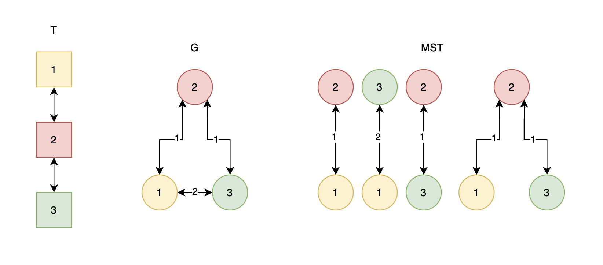

# F. SubMST

**time limit per test:** 5 seconds

**memory limit per test:** 256 megabytes

**input:** standard input

**output:** standard output

You are given an undirected unweighted tree $T$ with $n$ vertices.

Define a complete undirected weighted graph $G$ with $n$ vertices, where the weight of the edge between vertices $u$ and $v$ in $G$ is equal to the distance between the two vertices in the original tree.

For every possible subset of vertices, consider the minimum spanning tree (MST) of the subgraph of $G$ induced by that subset of vertices. Compute the sum of the weights of the MST for all possible subsets of vertices.

As this number is big, you are only required to output the sum modulo $10^9 + 7$.

#### Input

Each test contains multiple test cases. The first line contains the number of test cases $t$ ($1 \le t \le 10000$). The description of the test cases follows.

The first line contains an integer $n$ ($1 \leq n \leq 5000$), the number of vertices in the tree.

The following $n-1$ lines contains two integers $u$ and $v$ ($1 \leq u,v \leq n$), representing an edge between vertices $u$ and $v$ in the tree.

It is guaranteed that the sum of $n^2$ over all test cases does not exceed $5000^2$.

#### Output

Output a single integer, the sum of the MST weights for all possible subsets of vertices, modulo $10^9+7$.

#### Example

#### Input
```
5
3
1 2
2 3
7
3 1
1 2
3 5
4 5
3 6
6 7
22
4 11
9 7
3 18
19 8
16 20
5 22
13 20
15 12
2 8
12 1
17 4
6 7
1 21
10 18
7 3
20 15
14 21
18 4
8 15
22 17
11 14
1
2
2 1
```

#### Output
```
6
496
74069416
0
1
```

#### Note

The first test case is illustrated below. The subsets with at most one vertex are ommited since they have a weight of $0$ and therefore do not contribute to the sum.



