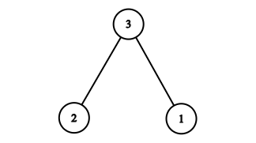
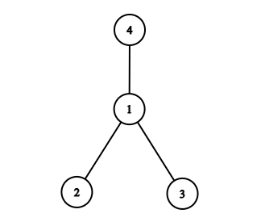

# G. Beautiful Tree

**time limit per test:** 2 seconds

**memory limit per test:** 256 megabytes

**input:** standard input

**output:** standard output

A tree is a connected graph without cycles.

A tree is called beautiful if the sum of the products of the vertex labels for all its edges is a perfect square.

More formally, let $E$ be the set of edges in the tree. The tree is called beautiful if the value $$S = \sum_{\{u, v\} \in E} (u \cdot v)$$ is a perfect square. That is, there exists an integer $x$ such that $S = x^2$.

You are given an integer $n$. Your task is to construct a beautiful tree having $n$ vertices or report that such a tree does not exist.

#### Input

The first line of input contains a single integer $t$ ($1 \le t \le 10^4$) — the number of testcases.

Each testcase contains a single integer $n$ ($2 \le n \le 2\cdot10^5$).

It is guaranteed that the sum of $n$ over all the testcases does not exceed $2\cdot10^5$.

#### Output

For each testcase, if there is no beautiful tree having $n$ vertices, print $-1$.

Otherwise, print $n-1$ lines denoting the edges of a beautiful tree having $n$ vertices. Each line should contain two space-separated integers $u,v$ ($1 \le u,v \le n$) representing an edge.

The vertices can be printed in any order within an edge, and the edges can be printed in any order.

#### Example

#### Input
```
3
2
3
4
```

#### Output
```
-1
1 3
2 3
1 2
3 1
4 1
```

#### Note

Test case 1: No beautiful tree exists with $2$ vertices. Hence, print $-1$.

Test case 2:




 $S = (2\cdot3) + (1\cdot3) = 9 = (3)^2$
Test case 3:




 $S = (2\cdot1) + (3\cdot1) + (4\cdot1) = 9 = (3)^2$
