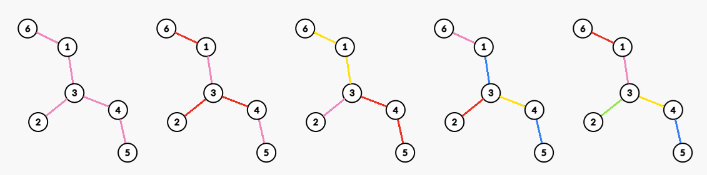

# E. Rainbow Branch

**time limit per test:** 3 seconds

**memory limit per test:** 1024 megabytes

**input:** standard input

**output:** standard output


Given a tree with $n$ vertices, you need to assign a color to each edge. Define the inconvenience of an assignment as the maximum number of colors on the path between any two vertices.

You need to assign exactly $k$ different colors (each color must appear at least once) to the edges while minimizing the inconvenience of the assignment.

Please calculate the minimum inconvenience for all $k=1,2,\ldots,n-1$.

#### Input

Each test contains multiple test cases. The first line contains the number of test cases $t$ ($1 \le t \le 10^4$). The description of the test cases follows.

The first line of the input contains one positive integer $n$ ($3\le n\le3\cdot10^5$) — the number of vertices.

The next $n-1$ lines each contain two positive integers $u_i,v_i$ ($1\le u_i,v_i\le n$) — indicating that there is an edge between vertices $u_i$ and $v_i$.

It is guaranteed that the edges in the input form a tree.

It is guaranteed that the sum of $n$ over all test cases does not exceed $3\cdot10^5$.

#### Output

For each test case, print a single line containing $n-1$ integers. The $i$-th integer represents the minimum inconvenience for $k=i$.

#### Example

#### Input
```
3
6
3 4
6 1
3 2
3 1
4 5
8
8 6
7 4
8 5
2 7
3 2
5 2
1 2
3
1 2
2 3
```

#### Output
```
1 2 2 3 4 
1 2 2 2 3 4 5 
1 2 
```

#### Note

In the first test case, possible solutions for $k=1,2,\ldots,n-1$ are as follows:



