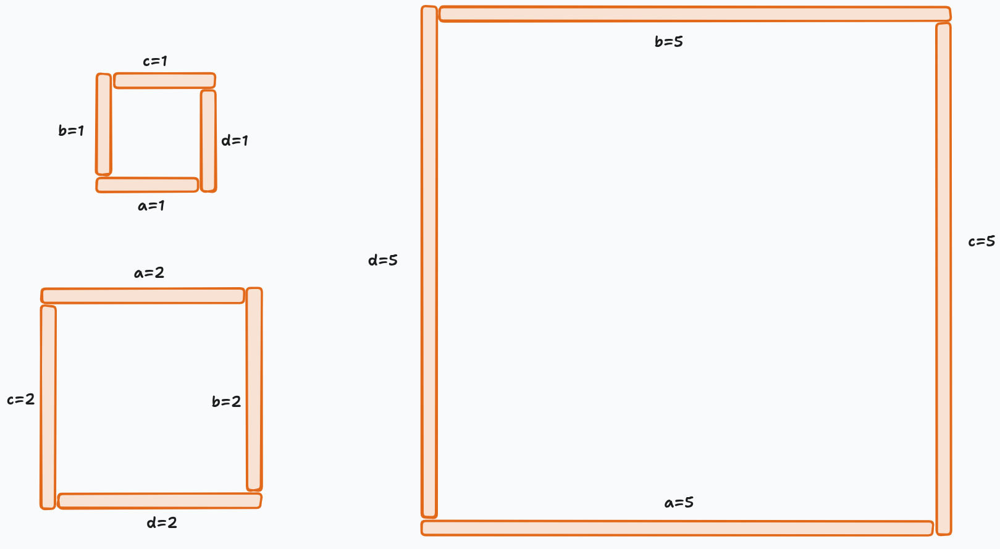

# A. Square?

**time limit per test:** 1 second

**memory limit per test:** 256 megabytes

**input:** standard input

**output:** standard output

You are given $4$ sticks of lengths $a$, $b$, $c$, and $d$. You can not break or bend them.

Determine whether it is possible to form a square$^{\text{∗}}$ using the given sticks.

$^{\text{∗}}$A square is defined as a polygon consisting of $4$ vertices, of which all sides have equal length and all inner angles are equal. No two edges of the polygon may intersect each other.

#### Input

The first line contains a single integer $t$ ($1 \le t \le 10^4$) — the number of test cases.

The only line of each test case contains four integers $a$, $b$, $c$, and $d$ ($1 \le a, b, c, d \le 10$) — the lengths of the sticks.

#### Output

For each test case, print "YES" if it is possible to form a square using the given sticks, and "NO" otherwise.

You may print each letter in any case (uppercase or lowercase). For example, the strings "yEs", "yes", "Yes", and "YES" will all be recognized as a positive answer.

#### Example

#### Input
```
7
1 2 3 4
1 1 1 1
2 2 2 2
1 2 1 2
1 1 5 5
5 5 5 5
4 10 5 9
```

#### Output
```
NO
YES
YES
NO
NO
YES
NO
```

#### Note

In the first test case, we can prove that we can't make a square.

In the second, third, and sixth test cases, we can make a square like this:



