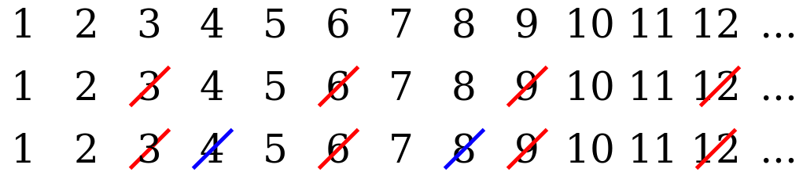

# D2. Removal of a Sequence (Hard Version)

**time limit per test:** 2 seconds

**memory limit per test:** 512 megabytes

**input:** standard input

**output:** standard output

This is the hard version of the problem. The difference between the versions is the constraint on $x$; in this version, $x \le 10^{12}$.

Polycarp has a sequence of all natural numbers from $1$ to $10^{12}$. He decides to modify this sequence by performing the following action $x$ times:

- Simultaneously remove all numbers at positions $y$, $2 \cdot y$, $3 \cdot y$, ..., $m \cdot y \le n$, where $n$ is the length of the current sequence.

After that, Polycarp wants to find the $k$-th number in the remaining sequence or determine that the length of the resulting sequence is less than $k$.

Help Polycarp solve this problem!

Consider an example. Let $x = 2$, $y = 3$, $k = 5$, then:





The numbers crossed out with a red line were removed after the first operation, and the numbers crossed out with a blue line were removed after the second operation. Thus, the number at position $k = 5$ is the number $10$.

#### Input

Each test contains multiple test cases. The first line contains the number of test cases $t$ ($1 \le t \le 10$). The description of the test cases follows.

The only line of each test case contains three integers $x$, $y$, $k$ ($1 \le x, y, k \le 10^{12}$).

#### Output

For each test case, output a positive integer that is at the $k$-th position in the resulting sequence, or $-1$ if the length of the resulting sequence is less than $k$.

#### Example

#### Input
```
6
2 3 5
2 5 1
20 2 1000000000000
175 10 28
1000000000 998244353 1999999999
1 1 1
```

#### Output
```
10
1
-1
2339030304
4672518823
-1
```
