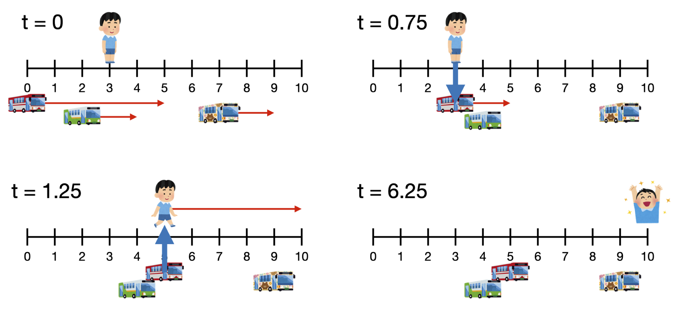

# B. Buses

**time limit per test:** 1 second

**memory limit per test:** 256 megabytes

**input:** standard input

**output:** standard output

There is a long straight road of length $\ell$ meters, where position $p$ denotes the point on the road that is $p$ meters away from the starting point. Along this road, there are $n$ buses moving in the positive direction, each traveling at the same constant speed of $x$ meters per minute. The $i$-th bus is currently at position $s_i$ and continues moving until it reaches its designated destination at position $t_i$. Once a bus reaches its destination, it ceases operation and all passengers must disembark.

There are also $m$ people who wish to reach the end of the road (position $\ell$). The current position of the $i$-th person is $p_i$, and each person can walk at a speed of at most $y$ meters per minute. If a person is at the same position as a bus, they may hop on the bus instantly. While riding a bus, they may hop off at any moment. The time required to board or leave a bus is considered negligible. Buses always move at a constant speed $x$ and never wait for passengers.

Your task is to determine the minimum possible time for each person to reach the end of the road.




 Figure 1: An illustration for sample input 1.

#### Input

The first line contains five integers $n$, $m$, $\ell$, $x$ and $y$, representing the number of buses, the number of people, the length of the road, the speed of the buses, and the walking speed of the people, respectively.

The $i$-th of the following $n$ lines contains two integers $s_i$ and $t_i$, representing the starting position and the destination position of the $i$-th bus.

The $i$-th of the following $m$ lines contains one integer $p_i$, representing the current position of the $i$-th person.

- $1 \leq n \leq 2 \times 10^5$
- $1 \leq m \leq 2 \times 10^5$
- $1 \leq \ell \leq 10^9$
- $1 \leq y \lt x \leq 10^6$
- $0 \leq s_i \lt t_i \leq \ell$
- $0 \leq p_i \leq \ell$

#### Output

Print $m$ lines. The $i$-th line contains a number which is the minimum time (in minutes) for the $i$-th person to reach the end of the road.

Your answer will be accepted if the absolute or relative error does not exceed $10^{-6}$. Formally, let your answer be $a$, and the jury's answer be $b$. Your answer is considered correct if $\frac{\left\vert a - b \right\vert}{\max(1, \left\vert b \right\vert)} \leq 10^{-6}$.

#### Examples

#### Input
```
3 3 10 4 1
0 5
2 4
7 9
3
8
5
```

#### Output
```
6.25
1.5
5
```

#### Input
```
1 3 100 100 1
1 2
0
1
2
```

#### Output
```
100
98.01
98
```

#### Note

Explanation of Sample 1: A person initially at position $p = 3$ can reach the end of the road in $6.25$ minutes as follows:

- Wait for Bus 1 to arrive.
- Hop on the bus and ride it until it reaches its destination at position $t_1 = 5$.
- Get off the bus and walk the remaining distance to position $\ell = 10$.

As shown in Figure 1, the total time spent is $6.25$ minutes, which is the minimum possible.
