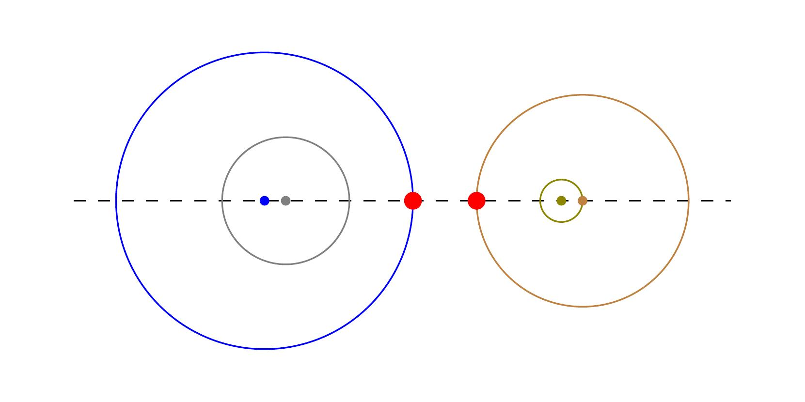
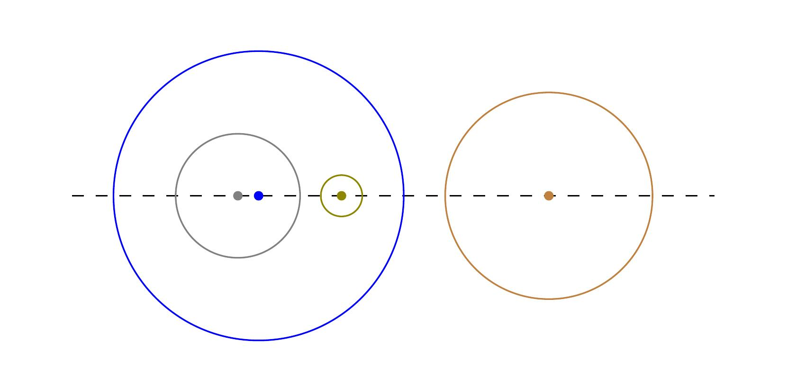

# C. Circles Are Far from Each Other

**time limit per test:** 3 seconds

**memory limit per test:** 256 megabytes

**input:** standard input

**output:** standard output

You are given $n$ circles and two integer parameters $k$ and $\ell$. The $i$-th circle has radius $r_i$ and $r_i \ge r_j$ holds for every $1 \le i \lt j \le n$. The task is to draw these $n$ circles on a 2D plane so that the following conditions are simultaneously satisfied. Before proceeding to the conditions, let us recall that:

- Each circle is uniquely determined by its center $O$ and radius $r$.
- A circle of radius $r$ is defined as the set of all points whose distance from its center $O$ is exactly $r$. All distances considered in this task are Euclidean.
- The interior region of a circle is defined as the set of all points whose distance from its center $O$ is less than $r$.
- We say that one circle $C$ encloses another circle $C^\prime$ if all points of $C^\prime$ lie inside the interior region of $C$.

You need to draw these $n$ circles to satisfy all of the following conditions:

- The centers of all circles are collinear.
- The distance between any two centers is at most $k$.
- No two circles intersect.
- If a circle encloses two circles $C$ and $C^\prime$, then either $C$ encloses $C^\prime$ or $C^\prime$ encloses $C$.
- The first $\ell$ circles may or may not be enclosed by other circles, whereas each of the remaining $n - \ell$ circles must be enclosed by at least one circle.

An arrangement that satisfies all the above conditions is called feasible. For a feasible arrangement $\mathcal{A}$, define its quality $d(\mathcal{A})$ as the minimum distance between any two points belonging to different circles.

If there exists at least one feasible arrangement for the given case, output the maximum possible quality among all feasible arrangements. If no feasible arrangements exist, output $0$.




 A feasible arrangement for sample input 1.



 An arrangement that is not feasible for sample input 1.

#### Input

The first line contains three integers $k$, $n$, and $\ell$, representing the maximum distance between centers, the number of circles to be drawn, and the number of circles that may or may not be enclosed by other circles, respectively.

The second line contains $n$ integers $r_1, r_2, \ldots, r_n$, where $r_i$ is the radius of the $i$-th circle.

- $1 \le k \le 10^9$
- $2 \le n \le 10^5$
- $1 \le \ell \le \min\{n, 200\}$
- $1 \le r_i \le 10^9$
- $r_i \ge r_j$ for every $1 \le i \lt j \le n$.

#### Output

If no feasible arrangements exist, output a single integer $0$.

Otherwise, output the maximum possible quality $d(\mathcal{A})$ among all feasible arrangements $\mathcal{A}$ in the following format:

- If $d(\mathcal{A})$ is an integer, output it as a single integer.
- If $d(\mathcal{A})$ is not an integer, output it in the rational form $a/b$ such that $1 \le a, b \le 10^9$, $\gcd(a,b) = 1$, and $|d(\mathcal{A}) - a/b|$ is minimized. If multiple such forms satisfy the constraints, print any.

#### Examples

#### Input
```
15 4 3
7 5 3 1
```

#### Output
```
3
```

#### Input
```
14 6 1
7 5 4 3 2 1
```

#### Output
```
1
```

#### Input
```
14 2 2
5 4
```

#### Output
```
5
```

#### Input
```
22 4 4
4 4 1 1
```

#### Output
```
10/3
```

#### Input
```
13 3 3
6 3 1
```

#### Output
```
4
```

#### Note

Explanation of Example 1: A feasible arrangement is illustrated in the first figure, where each circle and its center are shown in a unique color.

In this arrangement, the minimum distance between any two points belonging to different circles is $3$, and the two points witnessing this distance are marked as red dots. Hence, the quality of this arrangement is $3$, which is the maximum possible among all feasible arrangements for this case. Note that only circle $4$ is required to be enclosed within another circle, while the remaining circles may or may not be enclosed.

The second figure shows an arrangement that is not feasible. In this case, circle $1$ encloses both circle $3$ and circle $4$, but neither of these two circles encloses the other, thereby violating condition $4$.
