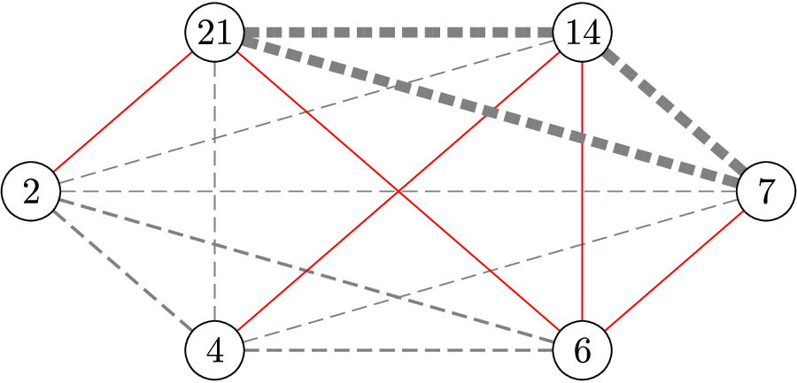

# F. Cluster Computing System

**time limit per test:** 1 second

**memory limit per test:** 256 megabytes

**input:** standard input

**output:** standard output

The ICPC company plans to build a cluster computing system consisting of $n$ servers. Each server has a database protocol type represented by a positive integer. Specifically, the $i$-th server has a protocol type $p_i$.

Initially, all servers are independent. The company wants to establish connections between servers so that, in the resulting network, every server can reach every other server (either directly or indirectly).

To achieve full connectivity, you may establish several connections. Each time you establish a connection, you must choose two servers $u$ and $v$ ($u \lt v$). The cost of establishing the connection between $u$ and $v$ is defined as the common protocol of the databases in the range from $u$ to $v$, calculated as $\gcd(p_u, p_{u+1}, \ldots, p_v)$ $^{\text{∗}}$.

Determine the minimum total cost required to fully connect all $n$ servers so that every server is reachable from every other server.




 An illustration for sample input 2.

$^{\text{∗}}$$\mathrm{gcd}$ is the largest positive integer that divides every integer in that set without leaving a remainder.

#### Input

The first line contains a single integer $n$, representing the number of servers.

The second line contains $n$ positive integers $p_1, p_2, \ldots, p_n$, where $p_i$ is the database protocol type of the $i$-th server.

- $2\leq n\leq 2\times 10^5$
- $1\leq p_i \leq 10^9$

#### Output

Output a single integer in a line, representing the minimum total cost required to fully connect the cluster computing system.

#### Examples

#### Input
```
3
4 2 6
```

#### Output
```
4
```

#### Input
```
6
2 4 6 7 14 21
```

#### Output
```
5
```

#### Note

Explanation of Example 2: The figure shows an example with protocol types $2$, $4$, $6$, $7$, $14$, and $21$. The costs of all possible connections are $1$, $2$, or $7$, indicated by different widths. There is a way to connect all together with five connections of cost $1$ each (displayed in red).
