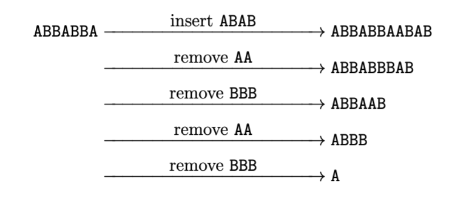

# G. Gene Editor

**time limit per test:** 1 second

**memory limit per test:** 256 megabytes

**input:** standard input

**output:** standard output

Biologists have recently discovered an interesting phenomenon in a particular type of organism. Each organism possesses a gene sequence consisting exclusively of two types of genes, represented by the characters A and B.

These organisms reproduce asexually, meaning that the offspring usually inherit an identical gene sequence. However, due to occasional cloning errors during reproduction, mutations may occur. Biologists have observed that these errors can take the following forms:

- Inserting the substring AA at any position in the gene sequence.
- Removing the substring AA from any position in the gene sequence; the remaining parts are concatenated without altering their order.
- Inserting the substring BBB at any position in the gene sequence.
- Removing the substring BBB from any position in the gene sequence; the remaining parts are concatenated without altering their order.
- Inserting a special substring $s$ at any position in the gene sequence.
- Removing the substring $s$ from any position in the gene sequence; the remaining parts are concatenated without altering their order.

These mutations may occur multiple times during a single cloning event and always happen sequentially, one at a time.

For example, suppose $s = \texttt{ABAB}$. An organism with gene sequence ABBABBA could produce an offspring with gene sequence A through the following series of mutations:





The biologists possess an organism with a specific gene sequence $t$. They are also interested in all possible organisms whose gene sequences have length $n$. Since each position in a gene sequence can be either A or B, there are $2^n$ such organisms in total.

The question is: Given strings $s$, $t$, and $n$, how many of these $2^n$ organisms (that is, all gene sequences of length $n$) can be produced from the organism with gene sequence $t$ through a sequence of valid mutation operations as described above?

Since the answer may be very large, output the result modulo $998244353$.

#### Input

Each test contains multiple test cases. The first line contains the number of test cases $q$. The description of the test cases follows.

The first line contains the string $s$, representing the special substring.

The second line contains the string $t$, representing the given gene sequence.

The third line contains an integer $n$, representing the interested length of organisms.

- $1 \le q \le 10$
- $2 \le |s| \le 11$
- The first character in $s$ is A.
- The last character in $s$ is B.
- There are no two consecutive A's in $s$.
- There are no three consecutive B's in $s$.
- $1 \le |t| \le 10^5$
- $1 \le n \le 10^9$

#### Output

For each test case, print an integer in one line, representing the answer modulo $998244353$.

#### Example

#### Input
```
2
ABAB
AABAB
1
ABAB
A
7
```

#### Output
```
1
22
```
