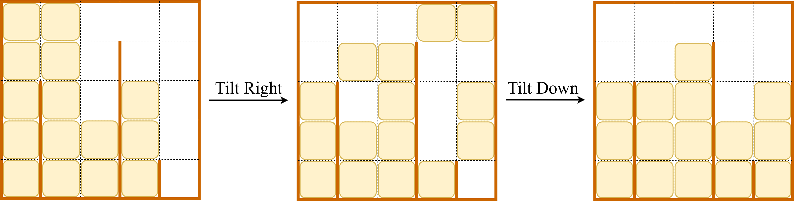

# J. Sliding Tiles

**time limit per test:** 4 seconds

**memory limit per test:** 256 megabytes

**input:** standard input

**output:** standard output

You have a special sliding puzzle played on an $n \times n$ grid. This puzzle is slightly different from standard sliding puzzles: between each pair of adjacent columns, there is a vertical bar of height $h_i$ (for $1 \leq i \lt n$) positioned at the bottom of the grid. Each $h_i$ indicates how many rows from the bottom this bar extends upwards, and it blocks tile movement between the two columns in those rows.

The grid contains several tiles, each occupying exactly one cell. These tiles can slide freely in the grid unless they are blocked by the grid boundaries, a vertical bar (depending on its height) or another tile.

The puzzle allows two types of tilt operations:

- Tilt right: All tiles slide to the right as far as possible.
- Tilt down: All tiles slide downward as far as possible.

In both operations, all tiles move simultaneously and stop only when blocked by the grid's edge, a bar, or another tile.




 Figure 1: An illustration for sample input 1.
Define a group operation as a sequence of: first tilt the grid to the right, then tilt it downward.

Initially, the $i$-th column has $a_i$ tiles stacked from the bottom of the column. You perform the group operation exactly once on the board. After the operation, determine the number of tiles in each column.

#### Input

The first line contains an integer $n$, representing the size of the board.

The second line contains $n$ integers $a_1,a_2,\ldots,a_n$, where $a_i$ is the number of tiles in the $i$-th column initially.

The third line contains $n-1$ integers $h_1,h_2,\ldots,h_{n-1}$, where $h_i$ is the height of the bar between column $i$ and column $i+1$.

- $2 \le n \le 5 \times 10^5$
- $0 \le a_i \le n$
- $0 \le h_i \le n-1$

#### Output

Print $n$ numbers in a new line, representing the number of tiles in each column after performing the group operation exactly once.

#### Examples

#### Input
```
5
5 5 2 3 0
3 0 4 1
```

#### Output
```
3 3 4 2 3
```

#### Input
```
6
4 3 0 3 0 2
1 0 0 1 3
```

#### Output
```
1 0 3 3 2 3
```
