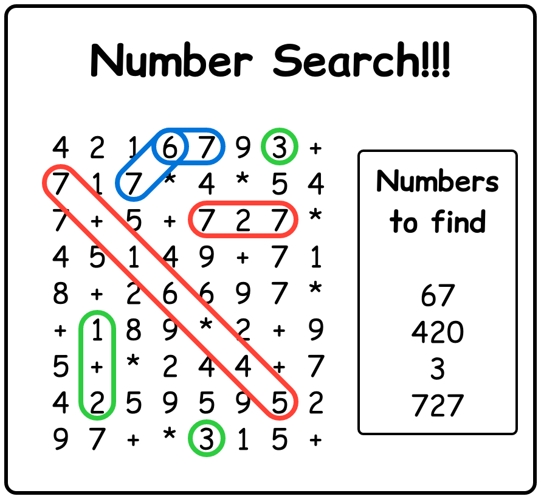

# K. Kindergarten Homework

**time limit per test:** 2 seconds

**memory limit per test:** 256 megabytes

**input:** standard input

**output:** standard output

Kenny is a kindergarten teacher who is teaching his students about math. To help them learn, he wants to give them homework in an enjoyable and non-annoying format – Number Search.

A Number Search puzzle is similar to a Word Search puzzle, but instead of words, it's about finding math expressions. An instance of the puzzle consists of two parts: a grid with $n$ rows and $m$ columns, and a list $a_1, a_2, \dots, a_q$ of $q$ target numbers to search for. Each cell in the grid contains a digit from 1 to 9, a plus sign +, or a multiplication sign *.

An expression can be formed by joining one or more consecutive characters along the same row, column, or diagonal, in a straight line (in either direction). Each expression can be defined by its starting cell and ending cell. Two expressions are considered different if they start or end at different cells, even if they contain the exact same characters.

A valid expression must be of the form $$ num \quad op \quad num \quad op \ \dots \ op \quad num $$ where each $num$ is a sequence of one or more digits, and each $op$ is either + or *. For example, "123" and "1+2*3+45" are valid expressions, while "+123" and "2**5" are not. The value of an expression is the result of evaluating it following typical arithmetic rules.

The goal of the puzzle is to count, for each number $a_i$, how many different valid expressions in the grid evaluate to $a_i$.

To demonstrate the rules, consider the following completed Number Search puzzle:





Let's denote the cell at row $r$ and column $c$ as $(r,c)$.

- The answer for $67$ is $2$, as there are two expressions "67" that start at $(1, 4)$. Although both expressions contain the same characters, they are considered different because they end at different positions.
- The answer for $420$ is $0$, as no expressions in the grid evaluate to $420$.
- The answer for $3$ is $4$:

 - The expression "3" appears twice, at $(1,7)$ and $(9,5)$.
 - The expression "1+2" appears from $(6,2)$ to $(8,2)$.
 - The expression "2+1" appears from $(8,2)$ to $(6,2)$. Even though they share the same set of cells, the two expressions are considered different because they start at different positions.

- The answer for $727$ is $3$:

 - The expression "7+16*45" appears from $(2,1)$ to $(8,7)$. Note that multiplication is performed before addition.
 - The expression "727" appears from $(3,5)$ to $(3,7)$, and from $(3,7)$ to $(3,5)$. Even though they share the same set of cells and contain the same characters, they are considered different because they start at different positions.


Kenny can't wait to see children enjoy solving interesting Number Search puzzles. But before giving them a puzzle, he needs to have the answers ready. Please help him calculate the answers for each puzzle he has prepared.

#### Input

The first line contains three integers $n$, $m$, and $q$, representing the number of rows, the number of columns, and the number of target numbers, respectively.

Each of the following $n$ lines contains a string of $m$ characters, representing the grid.

The $i$-th of the following $q$ lines contains an integer $a_i$, representing the $i$-th target number.

- $1 \leq n, m \leq 1000$
- $1 \leq n \times m \leq 3 \times 10^4$
- $1 \leq q \leq 10^5$
- The grid contains only the characters in "123456789+*".
- $1 \leq a_i \leq 10^6$
- All $a_i$ are distinct.

#### Output

Print $q$ lines. The $i$-th line contains an integer, representing the answer for $a_i$.

#### Example

#### Input
```
9 8 4
4216793+
717*4*54
7+5+727*
45149+71
8+26697*
+189*2+9
5+*244+7
42595952
97+*315+
67
420
3
727
```

#### Output
```
2
0
4
3
```
