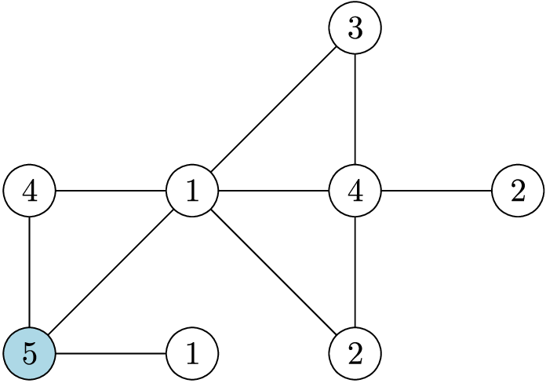

# M. Maximum Distance To Port

**time limit per test:** 1 second

**memory limit per test:** 256 megabytes

**input:** standard input

**output:** standard output

There are $n$ cities numbered from $1$ to $n$, connected by $m$ bidirectional roads, each exactly $1$ kilometer long. The road network forms a connected simple graph.

Each city produces exactly one of $k$ types of agricultural products, numbered from $1$ to $k$. City $1$ is the main port where all products must be delivered.

The government wants to estimate the worst-case transportation cost and time for exporting agricultural goods. To achieve this, they need to determine, for each product type, the longest among the shortest distances (in kilometers) from any city producing that product to the port city.

Your task is to compute this maximum shortest distance for each product type.




 Figure 1: An illustration for sample input 2.

#### Input

The first line contains three integers $n$, $m$, and $k$, representing the number of cities, bidirectional roads, and product types, respectively.

The second line contains $n$ integers $a_1, a_2, \dots, a_n$, where $a_i$ is the product type produced by city $i$.

The $i$-th of the following $m$ lines contains two integers $u_i$ and $v_i$, representing that the $i$-th bidirectional road connects cities $u_i$ and $v_i$.

- $1 \leq n \leq 2 \times 10^{5}$
- $0 \leq m \leq 2 \times 10^{5}$
- $1 \leq k \leq n$
- $1 \leq a_i \leq k$
- $1 \leq u_i, v_i \leq n$
- The graph is connected and simple (no self-loops or multiple edges).
- Every product type from $1$ to $k$ is produced by at least one city.

#### Output

Output $k$ integers in a single line. The $i$-th integer should be the maximum shortest distance (in kilometers) from any city producing product $i$ to the port city $1$.

#### Examples

#### Input
```
3 3 2
2 1 1
1 2
3 1
3 2
```

#### Output
```
1 0
```

#### Input
```
8 10 5
5 1 1 2 4 4 2 3
8 2
4 6
6 2
5 2
2 7
8 6
1 2
7 6
3 1
1 5
```

#### Output
```
1 3 2 2 0
```

#### Note

Explanation of Example 2: Figure 1 illustrates this example. In this example, the port is the blue node. All goods of product type 5 are already in the port, so their transportation cost is 0. The transportation cost for product type 4 is higher. One city with product type 4 has a distance of 1 to the port, while another one has a distance 2. Therefore, the transportation cost is 2.
