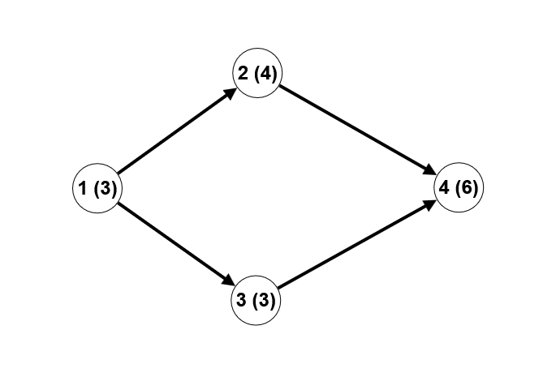
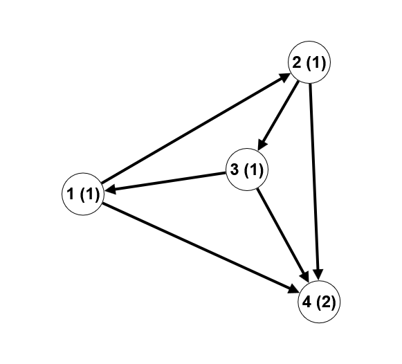

# D. Fibonacci Paths

**time limit per test:** 2 seconds

**memory limit per test:** 256 megabytes

**input:** standard input

**output:** standard output

You are given a directed graph consisting of $n$ vertices and $m$ edges. Each vertex $v$ corresponds to a positive number $a_v$. Count the number of distinct simple paths$^{\text{∗}}$ consisting of at least two vertices, such that the sequence of numbers written at the vertices along the path forms a generalized Fibonacci sequence.

In this problem, we will consider that the sequence of numbers $x_0, x_1, \ldots, x_k$ forms a generalized Fibonacci sequence if:

- $x_0, x_1$ are arbitrary natural numbers.
- $x_i = x_{i - 2} + x_{i - 1}$ for all $2 \le i \le k$.

Note that a generalized Fibonacci sequence consists of at least two numbers.

Since the answer may be large, output it modulo $998\,244\,353$.

$^{\text{∗}}$A simple path in a directed graph is a sequence of vertices $v_1, v_2, \ldots, v_k$ such that each vertex in the graph appears in the path at most once and there is a directed edge from $v_i$ to $v_{i+1}$ for all $i \lt k$.

#### Input

Each test contains multiple test cases. The first line contains the number of test cases $t$ ($1 \le t \le 10^4$). The description of the test cases follows.

The first line of each test case contains two numbers $n$, $m$ ($2 \le n \le 2 \cdot 10^5$, $1 \le m \le 2 \cdot 10^5$) — the number of vertices and the number of edges in the graph, respectively.

The second line of each test case contains $n$ natural numbers $a_1, a_2, \ldots, a_n$ ($1 \le a_i \le 10^{18}$) — the numbers written at the vertices.

The next $m$ lines contain the edges of the graph; each edge is defined by two natural numbers $v, u$ ($1 \le v, u \le n$, $u \neq v$), denoting a directed edge from $v$ to $u$. It is guaranteed that there are no multiple edges in the graph.

It is guaranteed that the sum of $n$ and the sum of $m$ across all test cases do not exceed $2 \cdot 10^5$.

#### Output

For each test case, output the number of paths that form a generalized Fibonacci sequence, modulo $998\,244\,353$.

#### Example

#### Input
```
4
4 4
3 4 3 6
1 2
1 3
2 4
3 4
4 6
1 1 1 2
1 2
2 3
3 1
1 4
2 4
3 4
8 11
2 4 2 6 8 10 18 26
1 2
2 3
3 1
4 3
2 4
3 5
5 6
4 6
6 7
7 5
5 8
2 2
10 10
1 2
2 1
```

#### Output
```
5
9
24
2
```

#### Note

Explanation of the first test case example (the vertex number is outside the brackets, the number written in the vertex is inside):




 In this case, there are 5 generalized Fibonacci paths: ($1, 2$), ($1, 3$), ($2, 4$), ($3, 4$), ($1,3,4$). For example, for the path ($1,3,4$), the sequence of numbers written at the vertices along this path is: [$3,3,6$]. As can be easily seen, the third number in the sequence is the sum of the two previous ones.
Explanation of the second test case example:




 In this case, there are 9 generalized Fibonacci paths: ($1, 2$), ($1, 4$), ($2, 3$), ($2, 4$), ($3, 1$), ($3, 4$), ($1, 2, 4$), ($2, 3, 4$), ($3, 1, 4$). Note that for the path ($1, 2, 3$), the sequence of numbers written at the vertices along this path is: [$1,1,1$], and it is not a generalized Fibonacci sequence.
