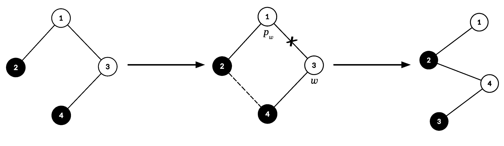
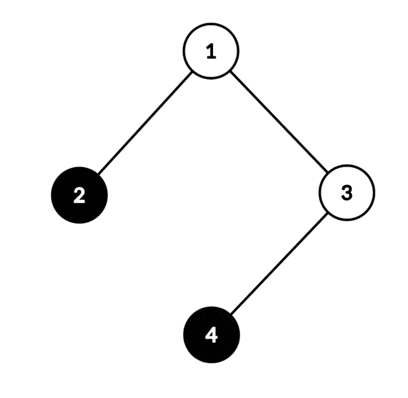
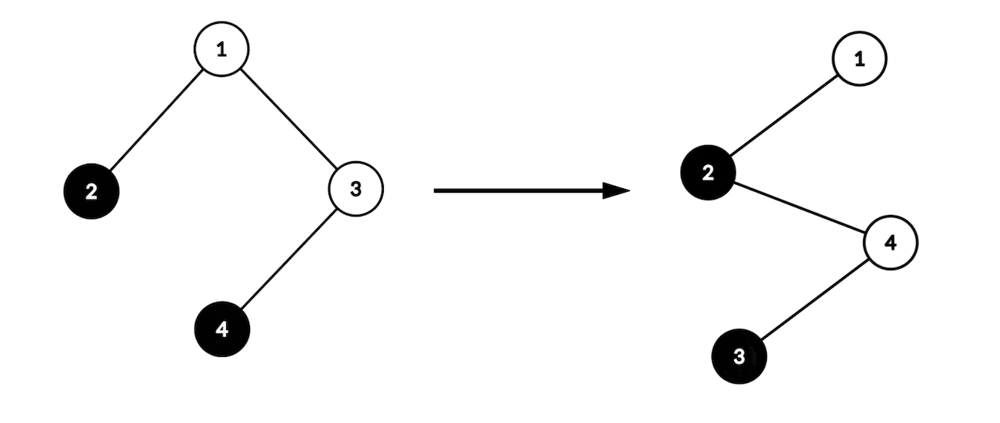
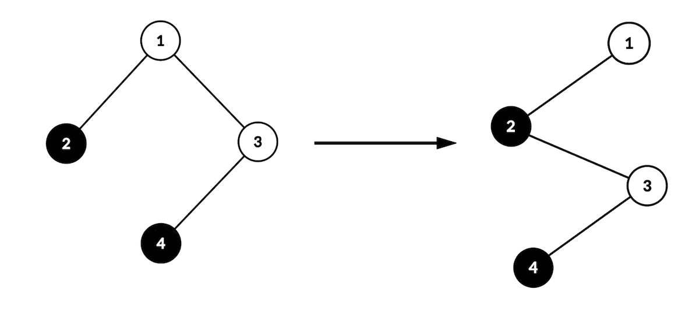
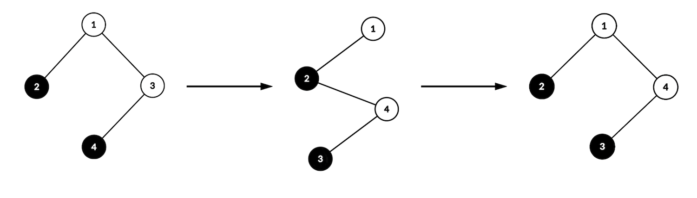

# F. Conquer or of Forest

**time limit per test:** 2 seconds

**memory limit per test:** 512 megabytes

**input:** standard input

**output:** standard output


Define the unique ornamental coloring of a rooted tree$^{\text{∗}}$ as the following vertex coloring:

- A vertex $v$ is colored white if the number of vertices in the subtree$^{\text{†}}$ rooted at $v$ is even;
- Otherwise, $v$ is colored black.

On his quest to conquer a forest of Christmas trees, Yuuki encountered an ornamentally colored tree $T$ with $n$ vertices labeled from $1$ to $n$, rooted at vertex $1$.

Yuuki considers the tree conquered if and only if at least one of the following conditions holds:

- There are no white vertices in the tree, or
- There exists some vertex $v$ such that all white vertices lie on the simple path from the root $1$ to $v$.

To conquer the tree, Yuuki can apply the following operation on $T$ an arbitrary number of times (possibly zero):

- First, choose a vertex $w$ that is colored white and is not the root of $T$. Let $p_w$ be the parent of $w$.
- Then, remove the edge connecting $p_w$ and $w$, and add an edge between any two vertices such that $T$ remains a tree.
- Finally, recolor the vertices of $T$ such that it is ornamentally colored. Note that $T$ is always rooted at vertex $1$.




 A possible application of the operation in the first test case. The resulting tree is conquered since all white vertices lie on the path between vertices $1$ and $3$.
Compute the number of distinct$^{\text{‡}}$ conquered trees that Yuuki can construct by applying the above operation an arbitrary number of times on $T$. Since the answer may be large, output it modulo $998\,244\,353$.

Note that Yuuki cannot stop midway through an operation (in particular, he must recolor the tree before checking if it is conquered). Additionally, Yuuki is allowed to apply the operation even if the tree is already conquered.

$^{\text{∗}}$A tree is a connected graph without cycles.

$^{\text{†}}$A subtree of vertex $v$ is the subgraph of $v$, all its descendants, and all the edges between them.

$^{\text{‡}}$Two trees are considered distinct if and only if there exists a pair of vertices such that there is an edge between them in one of the trees, and not in the other.

#### Input

Each test contains multiple test cases. The first line contains the number of test cases $t$ ($1 \le t \le 10^4$). The description of the test cases follows.

The first line of each test case contains a single integer $n$ ($2\le n\le 2\cdot 10^5$) — the number of vertices in $T$.

Then $n-1$ lines follow, the $i$-th line containing two integers $u_i$ and $v_i$ ($1\le u_i \lt v_i\le n$) — the two vertices that the $i$-th edge connects.

It is guaranteed that the given edges form a tree.

It is guaranteed that the sum of $n$ over all test cases does not exceed $2\cdot 10^5$.

#### Output

For each test case, output a single integer — the number of distinct conquered trees that can be constructed from $T$, modulo $998\,244\,353$.

#### Example

#### Input
```
5
4
1 2
1 3
3 4
5
1 2
1 3
1 4
1 5
5
1 2
2 3
1 4
4 5
6
1 2
2 3
2 4
2 6
5 6
11
2 10
6 8
1 6
3 7
5 11
5 8
5 9
4 7
6 7
2 6
```

#### Output
```
4
1
16
8
2048
```

#### Note

In the first test case, below are the four conquered trees that can be constructed and a sequence of operations that constructs each one.
 ExplanationIllustration

- The operation is applied zero times.
- The given tree is already conquered since all white vertices lie on the simple path between vertices $1$ and $4$.



- The first and only operation selects $w$ to be vertex $3$ ($p_w$ is vertex $1$) and draws an edge between vertices $2$ and $4$.
- The resulting tree is conquered since all white vertices lie on the simple path between vertices $1$ and $3$.



- The first and only operation selects $w$ to be vertex $3$ ($p_w$ is vertex $1$) and draws an edge between vertices $2$ and $3$.
- The resulting tree is conquered since all white vertices lie on the simple path between vertices $1$ and $3$.



- The first operation selects $w$ to be vertex $3$ ($p_w$ is vertex $1$) and draws an edge between vertices $2$ and $4$.
- The second operation selects $w$ to be vertex $4$ ($p_w$ is vertex $2$) and draws an edge between vertices $1$ and $4$.
- The resulting tree is conquered since all white vertices lie on the simple path between vertices $1$ and $4$.




In the second test case, Yuuki cannot apply the operation on $T$ since there are no white vertices. Additionally, $T$ is already conquered since there are no white vertices. Thus, the answer is $1$.
