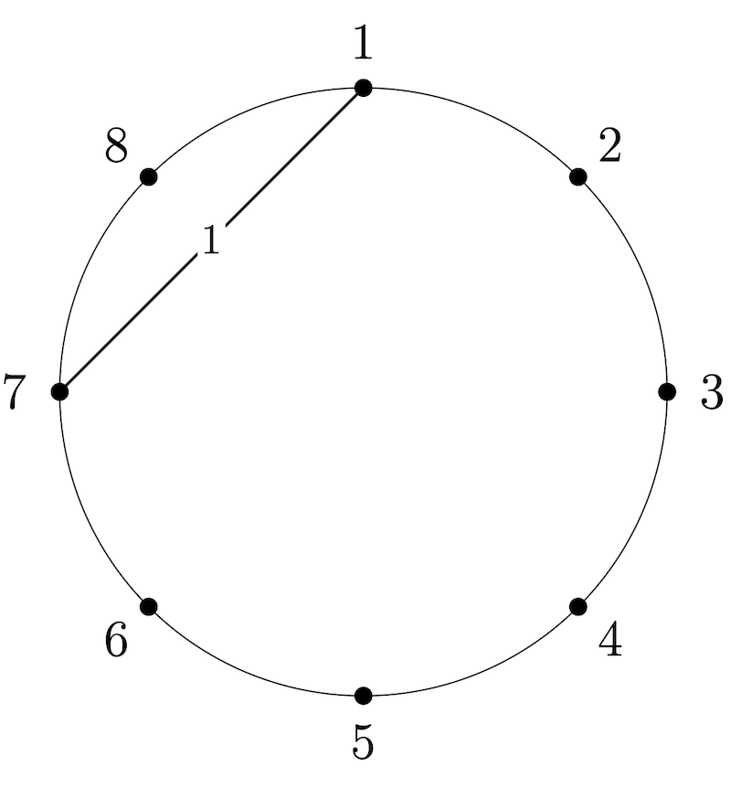
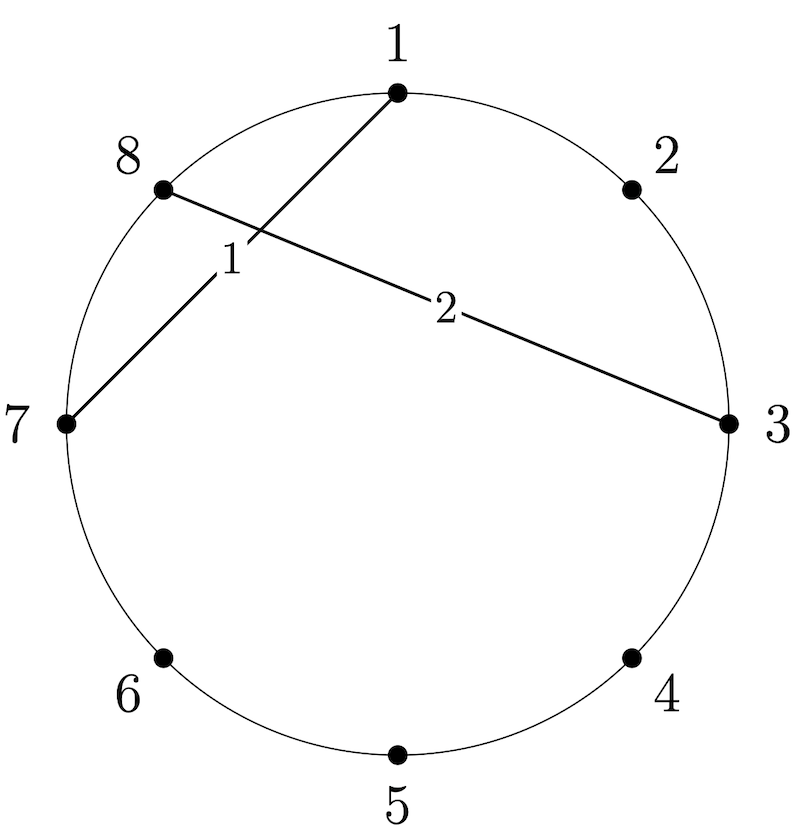
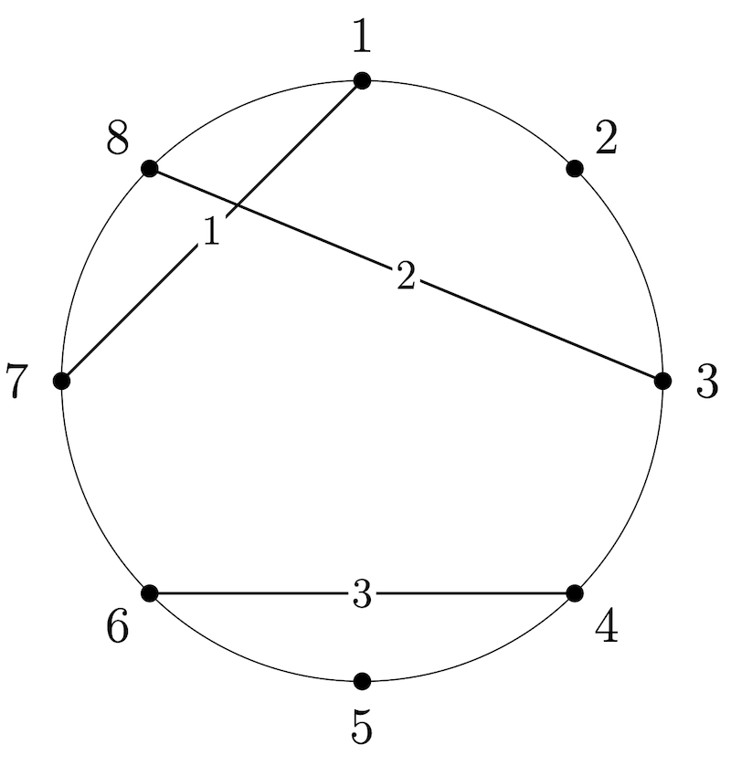
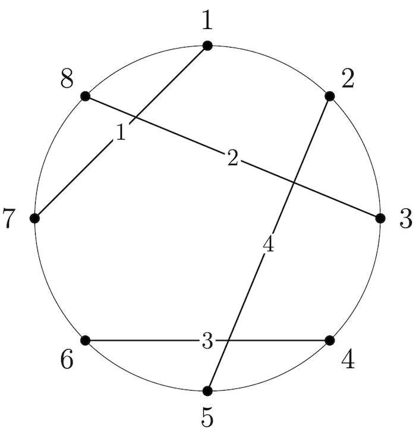

# G. deCH OR Dations

**time limit per test:** 3 seconds

**memory limit per test:** 512 megabytes

**input:** standard input

**output:** standard output


Due to supply chain issues in the North Pole (allegedly caused by a lazy elf), Santa is planning to give out hand-drawn circles as presents this Christmas. Please help him decorate them!

There are $2n$ equally spaced points around the circle, labeled $1,2,\ldots,2n$ in clockwise order. Santa has chosen $n$ chords with distinct endpoints, where chord $i$ connects the points $a_i$ and $b_i$. He draws these chords onto the circle one by one, in order.

After Santa has drawn the first $\ell$ chords, consider any non-empty subset $S$ of the $\ell$ chords and let $1\leq c_1 \lt c_2 \lt \cdots \lt c_{|S|}\leq \ell$ be their indices. $S$ is defined to be a chain if and only if chord $c_k$ intersects chord $c_{k+1}$ for all $1\leq k \lt |S|$. Note that $S$ is always a chain if $|S|=1$.

Santa does not want any chord to be the odd one out. Therefore, he considers the chords to be tight-knit if and only if every chord appears in an even number of chains, taken over all chains that are subsets of the first $\ell$ chords.

For each $\ell$ from $1$ to $n$, help Santa determine whether his chords are tight-knit.

#### Input

Each test contains multiple test cases. The first line contains the number of test cases $t$ ($1 \le t \le 10^4$). The description of the test cases follows.

The first line of each test case contains a single integer $n$ ($2\le n\le 5\cdot 10^5$) — the number of chords.

Then $n$ lines follow, the $i$-th line containing two integers $a_i$ and $b_i$ ($1\le a_i \lt b_i\le 2n$) — the endpoints of the $i$-th chord.

It is guaranteed that all endpoints are distinct.

It is guaranteed that the sum of $n$ over all test cases does not exceed $5\cdot 10^5$.

#### Output

For each test case, output a string of length $n$ — the $\ell$-th character should be $\texttt{1}$ if the first $\ell$ chords are tight-knit and $\texttt{0}$ otherwise.

#### Example

#### Input
```
3
3
1 6
2 3
4 5
4
1 7
3 8
4 6
2 5
5
1 6
4 9
2 7
5 10
3 8
```

#### Output
```
000
0100
01111
```

#### Note

In the first test case, no pairs of chords intersect, and thus every chord appears in exactly one chain consisting of itself. Therefore, the chords are not tight-knit for all $\ell$.

In the second test case, below is an illustration and explanation after the first $\ell=1,2,3,4$ chords are drawn. Sets of chords are denoted as a set of the indices of the corresponding chords.
 ExplanationIllustrationChains

- $\{1\}$.
 Appearances

- Chord $1$ appears in $1$ chain.
 Notes

- The chords are not tight-knit since chord $1$ is in an odd number of chains.
- Recall that a set containing a single chord is always a chain.



Chains

- $\{1\}$, $\{1,2\}$, and $\{2\}$.
 Appearances

- Chord $1$ appears in $2$ chains;
- Chord $2$ appears in $2$ chains.
 Notes

- The chords are tight-knit since every chord appears in an even number of chains.



Chains

- $\{1\}$, $\{1,2\}$, $\{2\}$, and $\{3\}$.
 Appearances

- Chord $1$ appears in $2$ chains;
- Chord $2$ appears in $2$ chains;
- Chord $3$ appears in $1$ chain.
 Notes

- The chords are not tight-knit since chord $3$ is in an odd number of chains.



Chains

- $\{1\}$, $\{1,2\}$, $\{1,2,4\}$, $\{2\}$, $\{2,4\}$, $\{3\}$, $\{3,4\}$, and $\{4\}$.
 Appearances

- Chord $1$ appears in $3$ chains;
- Chord $2$ appears in $4$ chains;
- Chord $3$ appears in $2$ chains;
- Chord $4$ appears in $4$ chains.
 Notes

- The chords are not tight-knit since chord $1$ is in an odd number of chains.
- Note that $\{2,3,4\}$ is not a chain since chord $2$ does not intersect chord $3$.




Thus, we output $\mathtt{0100}$.
