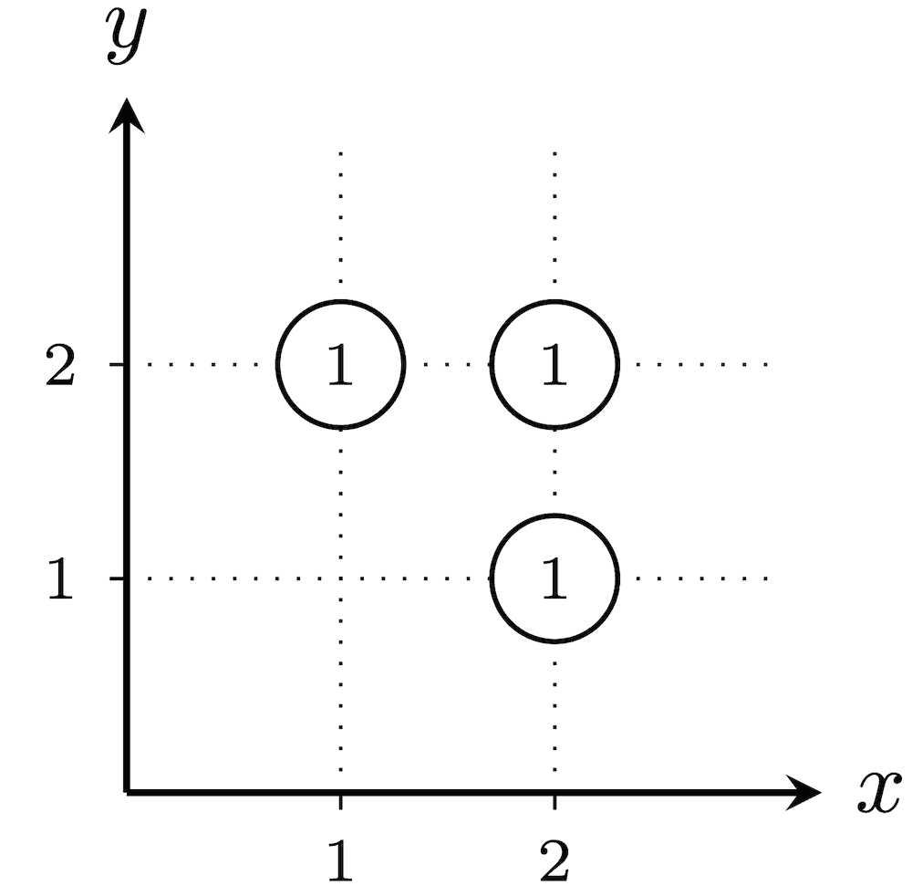
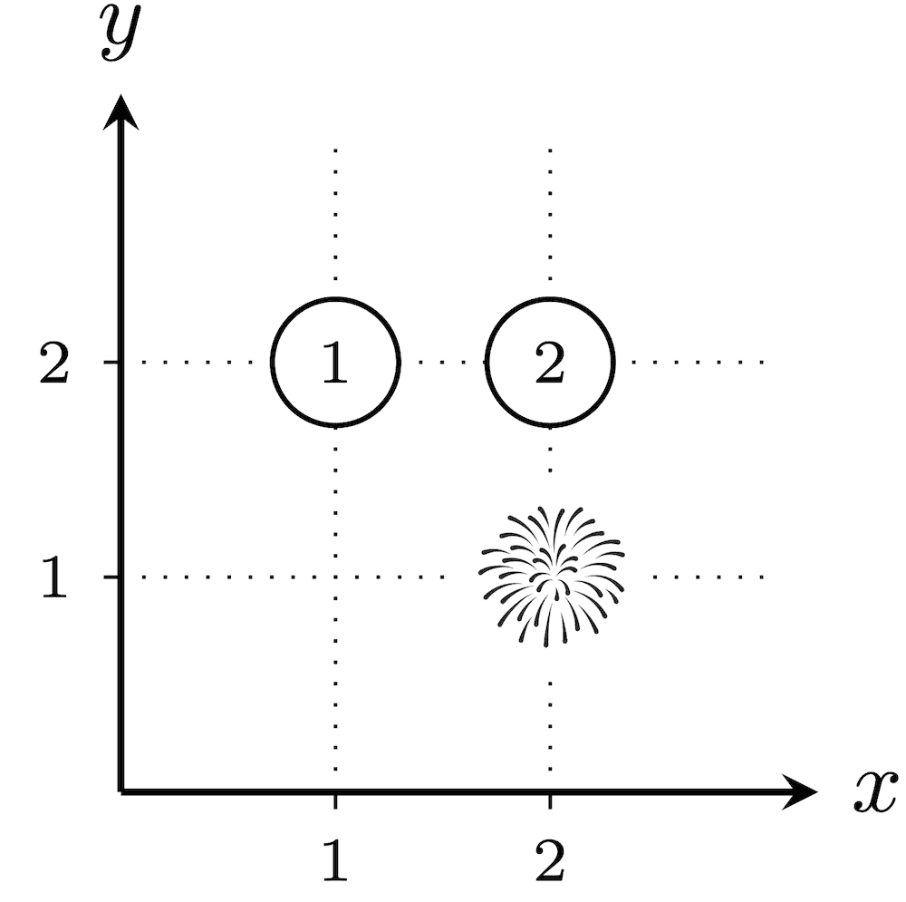
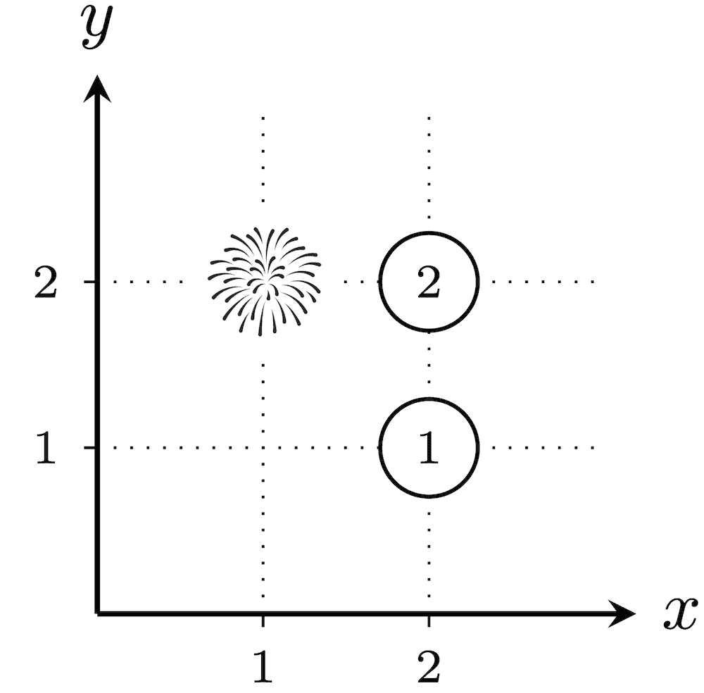
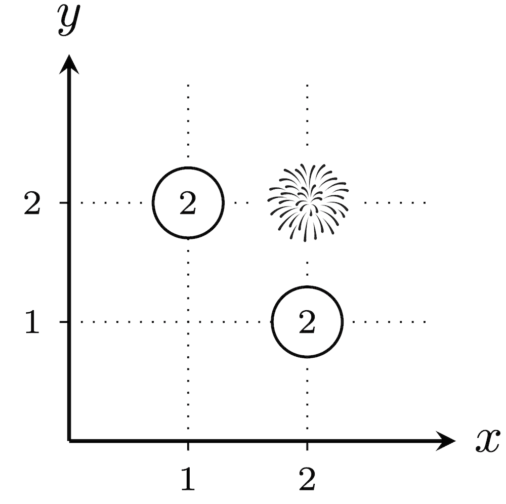
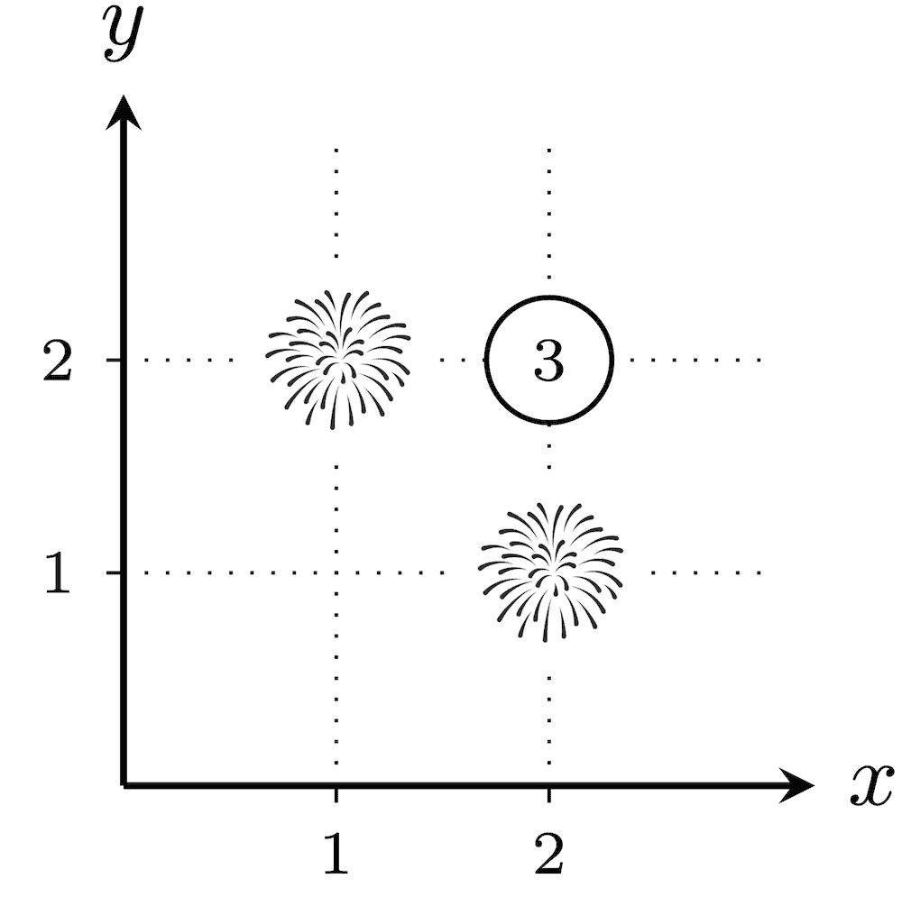
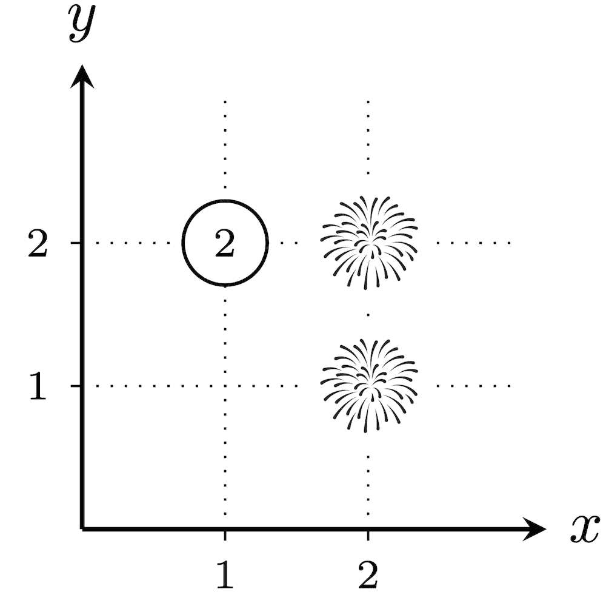
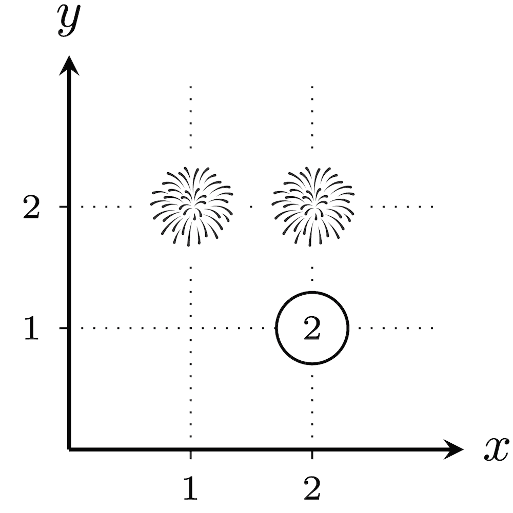

# I. Numbers or Fireworks

**time limit per test:** 12 seconds

**memory limit per test:** 1024 megabytes

**input:** standard input

**output:** standard output


Now that all the presents have been delivered, the North Pole is finally at peace — and it's time to celebrate with a spectacular New Year's fireworks show!

The North Pole is modeled as the Cartesian plane, with $n$ cities located at distinct lattice points. You are also given an integer $k$.

For a proper subset$^{\text{∗}}$ $T$ of the cities ($T$ may be empty), we define its explosiveness as follows:

- A firework is launched from every city in $T$.
- For each city $c$ not in $T$, let $f$ be the number of fireworks launched from cities that are exactly $\sqrt{k}$ Euclidean distance$^{\text{†}}$ away from $c$. Assign the number $(f+1)$ to this city $c$.
- The explosiveness of $T$ is the product of all numbers assigned in Step 2.

Compute the sum of the explosiveness of $T$ over all $2^n-1$ proper subsets $T$ of the cities. Since the answer may be large, output it modulo $998\,244\,353$.

$^{\text{∗}}$A proper subset is any subset which is not equal to the whole set.

$^{\text{†}}$The Euclidean distance between two points $(x, y)$ and $(p, q)$ is defined as $\sqrt{(x - p)^2 + (y - q)^2}$.

#### Input

Each test contains multiple test cases. The first line contains the number of test cases $t$ ($1 \le t \le 1000$). The description of the test cases follows.

The first line of each test case contains two integers $n$ and $k$ ($2\le n\le 31$, $1\leq k \leq2\cdot 10^4$).

Then $n$ lines follow, the $i$-th line containing two integers $x_i$ and $y_i$ ($1\leq x_i, y_i\leq 100$) — the $x$ and $y$ coordinates of the $i$-th city, respectively. It is guaranteed that the coordinates of the cities are pairwise distinct.

It is guaranteed that the sum of $n^3$ over all test cases does not exceed $31^3$.

#### Output

For each test case, print a single integer — the sum, modulo $998\,244\,353$, of the explosiveness over all proper subsets $T$ of the cities.

#### Example

#### Input
```
4
3 1
1 2
2 1
2 2
2 20000
1 1
100 100
9 5
1 1
1 2
1 3
2 1
2 2
2 3
3 1
3 2
3 3
13 25
50 50
55 50
54 53
53 54
50 55
47 54
46 53
45 50
46 47
47 46
50 45
53 46
54 47
```

#### Output
```
16
3
8255
560112
```

#### Note

In the first test case, below are the $2^3-1=7$ possible placements of fireworks. The numbers assigned to cities not in $T$ are circled.















 The total explosiveness is $(1\cdot 1\cdot 1)+(1\cdot 2)+(2\cdot 1)+(2\cdot 2)+(3)+(2)+(2)=16$.

In the second test case, there are $2^2-1=3$ possible placements of fireworks. For every placement, since $(1,1)$ and $(100,100)$ have a Euclidean distance of $\sqrt{(100-1)^2+(100-1)^2}=\sqrt{19\,602}\neq\sqrt{20\,000}$, none of the cities will have fireworks that are exactly $\sqrt{k}$ away. Thus, the number $1$ is assigned to every city without fireworks. Therefore, the explosiveness is $1$ for every $T$, and the answer is $1+1+1=3$.
