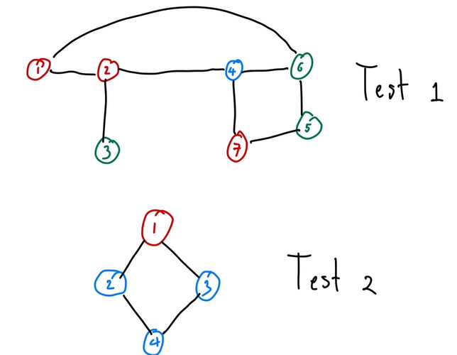

# F. Blackslex and Another RGB Walking

**time limit per test:** 5 seconds

**memory limit per test:** 256 megabytes

**input:** standard input

**output:** standard output

This is a run-twice (communication) problem.

There are two players: Player A (Agent) and Player B (Blackslex). The jury will first interact with player A. After player A ends their interaction, the jury will interact with player B. Note that player A and player B may not directly pass information to each other; both players are only able to send information or receive information from the jury, but they may agree on the strategy they will use to communicate.

The Penguin Republic is a [bipartite](<https://en.wikipedia.org/wiki/Bipartite_graph>) connected undirected graph $G$ with $n$ vertices and $m$ edges. Blackslex is going to conduct forbidden field research at vertex $1$. Due to travel restrictions, he will be dropped off at an unknown vertex $v$ ($2 \leq v \leq n$). He must get to vertex $1$ while having no information on the graph.

For his journey, he has bribed a penguin agent and agreed to some communication strategy using the following method; the agent will discreetly mark each vertex in one of the three colors: red, green, or blue. From Blackslex's perspective, he will see only the color $c_i$ of each neighbor $u_i$ ($1 \leq i \leq d(v)$$^{\text{∗}}$) of $v$. He must choose some $j$ ($1 \leq j \leq d(v)$) and move to vertex $u_j$ such that he is closer to vertex $1$.

Note that the neighbors are arbitrarily ordered. He sees only the colors of the neighboring vertices, and not the vertex that he is on. Additionally, he does not know the index of the vertex he's on, the neighboring vertices, or any other vertex.

Your task is to implement the strategy for both the agent and Blackslex. For the agent, you must color each vertex in one of the three colors. For Blackslex, you are given $q$ queries. In each query, you are dropped off at an arbitrary and unknown vertex $v$ and given the color of the neighboring vertices. You must determine a vertex to go to such that you are closer to vertex $1$.

$^{\text{∗}}$The number of neighbors of vertex $v$.

#### Input

Your code will be ran exactly two times on each test. On the first run, you will be Player A (Agent), and on the second Player B (Blackslex).

First Run Input

The first line of the input contains the string first. The purpose of this is so your program recognizes that this is its first run, and it should act as Player A.

Each test contains multiple test cases. The first line contains the number of test cases $t$ ($1 \leq t \leq 10^4$). The description of the test cases follows.

The first line of each test case contains two integers $n$ and $m$ ($2 \leq n \leq 10^5$, $n-1 \leq m \leq 10^5$) — the number of vertices and edges respectively.

The following $m$ lines contain information about the edges. The $i$-th ($1 \leq i \leq m$) line has two integers $a_i$ and $b_i$. ($1 \leq a_i, b_i \leq n$, $a_i \neq b_i$) — vertex $a_i$ is connected to vertex $b_i$ by edge $i$.

It is guaranteed that:

- The sum of $n$ and the sum of $m$ does not exceed $10^5$ over all test cases.
- The graph in each test case is bipartite and connected. It has no duplicate edges and no self-loops.

Second Run Input

The first line of the input contains the string second. The purpose of this is so your program recognizes that this is its second run, and it should act as Player B.

Each test contains multiple test cases. The first line contains the number of test cases $t$ ($1 \leq t \leq 10^4$) — the same value of $t$ in the first run. The description of the test cases follows.

The first line of each test case contains one integer $q$ ($1 \leq q \leq 10^5$) — the number of queries in this test case.

The first line of each query contains one integer $d(v)$ ($1 \leq d(v) \leq 10^5$) — the number of neighbors of the vertex $v$ that Blackslex is currently on.

The next line of each query contains a string $c$ of length $d(v)$ — the $i$-th ($1 \leq i \leq d(v)$) character of the string is the color of the neighboring vertex $u_i$. The characters in the string are r, g, or b representing red, green, or blue.

It is guaranteed that:

- The sum of $q$ does not exceed $10^5$ over all queries in all test cases.
- The sum of $d(v)$ does not exceed $2 \cdot 10^5$ over all queries in all test cases.
- $v \neq 1$

The input of the second run is not adaptive. In other words, the input of the second run will not change in different runs.

Hacks

To make hacks, use the following format:

The first line contains one integer $t$ ($1 \leq t \leq 10^4$) — the number of test cases.

The description of the test cases for the first run follows.

The first line of each test case contains two integers $n$ and $m$ ($2 \leq n \leq 10^5$, $n-1 \leq m \leq 10^5$) — the number of vertices and edges respectively.

The following $m$ lines contain information about the edges. The $i$-th ($1 \leq i \leq m$) line has two integers $a_i$ and $b_i$. ($1 \leq a_i, b_i \leq n$, $a_i \neq b_i$) — vertex $a_i$ is connected to vertex $b_i$ by edge $i$.

After that, the description of the test cases for the second run follows.

The first line of each test case contains one integer $q$ ($1 \leq q \leq 10^5$) — the number of queries in this test case.

The first line of each query contains one integer $v$ ($2 \leq v \leq n$) — the vertex the Blackslex is dropped off.

The second line of each query contains $d(v)$ integers $p_1, p_2, \ldots, p_{d(v)}$ ($1 \leq p_i \leq d(v)$, each number in $p$ is distinct) — the ordering of the neighbor is as follows; let $q_1 \lt q_2 \lt \ldots \lt q_{d(v)}$ be the neighbors of $v$, then the input order of the neighbor is $u_i = q_{p_i}$.

It must hold that:

- The sum of $n$ and the sum of $m$ does not exceed $10^5$ over all test cases in the first run.
- The graph in each test case is bipartite and connected. It has no duplicate edges and no self-loops.
- The sum of $q$ does not exceed $10^5$ over all queries in all test cases.
- The sum of $d(v)$ does not exceed $2 \cdot 10^5$ over all test cases in the second run.

#### Output

For the first run, for each test case, output a single string $s$ of length $n$ — $s_i$ ($1 \leq i \leq n$) is the color of the $i$-th vertex, painted by the agent. The characters in the string are r, g, or b representing red, green, or blue.

For the second run, for each query in each test case, output a single integer $j$ ($1 \leq j \leq d(v)$) — $u_j$ is the neighboring vertex that Blackslex will go to next.

#### Examples

#### Input
```
first
2
7 8
1 2
1 6
3 2
4 2
6 4
4 7
5 6
5 7

4 4
1 2
1 3
4 2
4 3
```

#### Output
```
rrgbggr
rbbb
```

#### Input
```
second
2
2
3
grr
3
gbr

1
2
rb
```

#### Output
```
1
3
1
```

#### Note




 Graph and coloring of both tests.
In the sample, there are two test cases. The graph and the sample's vertex coloring are demonstrated in the picture above.

In the second run, the first test case has two queries.

The first query is on vertex $4$ with the neighbors ordered as vertex $6$, $2$, and $7$. Choosing the first neighbor is walking to vertex $6$.

The second query is on vertex $6$ with the neighbors ordered as vertex $5$, $4$, and $1$. Choosing the third neighbor is walking to vertex $1$.

The second test case has a single query on vertex $2$ with the neighbors ordered as vertex $1$ and $4$. Choosing the first neighbor is walking to vertex $1$.

Note that the empty lines are made to assist reading. Actual test cases do not have empty lines.

[In-contest only] Link to image in case of the image not loading: [https://ibb.co/yFZS16vj](<https://ibb.co/yFZS16vj>)
