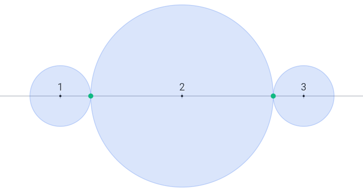
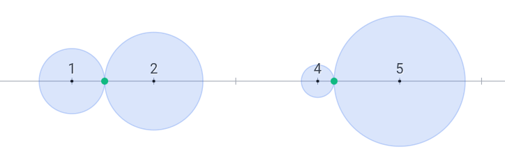

# D. Insolvable Disks

**time limit per test:** 2 seconds

**memory limit per test:** 256 megabytes

**input:** standard input

**output:** standard output

You are given $n$ different integer points $x_1 \lt x_2 \lt \ldots \lt x_n$ on the X-axis of the plane. For each $1 \le i \le n$, you have to pick a real value $r_i \gt 0$ and draw a disk with radius $r_i$ and center $x_i$ such that no two disks overlap.

You want to choose values $r_i$ in such a way that the number of tangent pairs of disks is maximized, and you have to find this maximum value.

We say that two disks overlap if the area of their intersection is positive. In particular, two outer tangent disks do not overlap.

#### Input

Each test contains multiple test cases. The first line contains the number of test cases $t$ ($1 \le t \le 10^4$). The description of the test cases follows.

The first line of each test case contains a single integer $n$ ($1 \le n \le 2\cdot10^6$) — the number of points in that test case.

The second line of each test case contains $n$ integers $x_1, x_2, \ldots x_n$ ($0 \le x_1 \lt x_2 \lt \ldots \lt x_n \le 10^9$) — the coordinates of the points in that test case.

It's also guaranteed that the sum of $n$ over all test cases is at most $2\cdot10^6$.

#### Output

For each test case, print a single integer denoting the maximum number of tangent pairs of disks in that test case.

#### Example

#### Input
```
4
3
1 2 3
4
1 2 4 5
6
1 2 11 12 21 22
7
0 1 2 3 5 8 13
```

#### Output
```
2
2
3
6
```

#### Note

In the first test case, you can let $r_1 = r_3 = 0.25$ and $r_2 = 0.75$ so the 1-st and 2-nd disks and the 2-nd and 3-rd disks will be pairwise tangent.




 Best solution for the first test case
In the second test case, you can let $r_1 = 0.4$, $r_2 = 0.6$, $r_3 = 0.2$, and $r_4 = 0.8$ so the 1-st and 2-nd disks and 3-rd and 4-th disks will be pairwise tangent.




 Best solution for the second test case
The best solution in the third test case is to set $r_i = 0.5$ for each $1 \le i \le 6$ so the 1-st and 2-nd disks, 3-rd and 4-th disks, and 5-th and 6-th disks will be pairwise tangent.

[Link to the visualizer](<https://codeforces.com/assets/contests/2180/D_uZiePo9ziin2eish5yai.html>)
