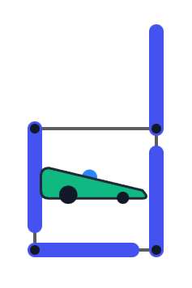
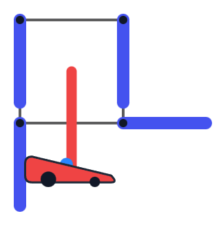
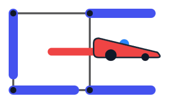

# F2. Control Car (Hard Version)

**time limit per test:** 2 seconds

**memory limit per test:** 256 megabytes

**input:** standard input

**output:** standard output

The two versions differ in the limits, including variable bounds, as well as time and memory constraints. You can hack only if you solve both versions of this problem. Note that a correct solution for the hard version is not necessarily a valid solution for the easy version.

We have a control car that behaves like a random variable. As a random variable is neither truly random nor truly variable, our control car is neither a car nor controllable!

Anyhow, we are given a grid of size $n \times m$ formed by the intersections of $n+1$ horizontal lines and $m+1$ vertical lines. The grid contains $(n+1)(m+1)$ intersection points, which are the corners surrounding the cells.

An orientation is an assignment of one of the four cardinal directions (up, down, left, right) to each of these $(n+1)(m+1)$ intersection points. Therefore, there are $4^{(n+1)(m+1)}$ possible orientations.

Consider the process below for an orientation:

- For each point in the grid, we draw a wall extending in the direction it is oriented with length one unit. Walls may overlap or extend beyond the grid boundary.
- Place the control car at the top-left corner cell $(1, 1)$. Then, as long as the car has not stopped, it moves according to these rules:

 - If it can move down (i.e., no wall blocks the path to the cell directly below), it moves down because of gravity.
 - If it cannot move down but can move right (i.e., no wall blocks the path to the cell directly to its right), it moves right.
 - If the car exits the grid or cannot move, it stops.

- The orientation is valid if the control car stops inside the grid.

Count the number of valid orientations. As the number of valid orientations can be huge, print the answer modulo $10^9+7$.

#### Input

Each test contains multiple test cases. The first line contains the number of test cases $t$ ($1 \le t \le 50$). The description of the test cases follows.

The first line of each test case contains two integers $n$ and $m$ ($1 \le n \le \mathbf{50}$, $1 \le m \le \mathbf{10^{15}}$), the sizes of the grid.

The sum of $n$ over all test cases is at most $\mathbf{50}$.

#### Output

For each test case, output the number of valid orientations modulo $10^9+7$.

#### Example

#### Input
```
5
1 1
2 1
1 2
2 2
44 1000000000000000
```

#### Output
```
40
1072
784
91072
179226577
```

#### Note

In the first test case, for an orientation to be valid, we need at least one of the lower-left or lower-right walls to cover the bottom border of the square. We also need at least one of the upper-right or lower-right walls to cover the right border. If both of these conditions hold, then the orientation is valid.

Now, if the upper-right corner points downward and the lower-left corner points to the right, then the upper-left and lower-right corners can point in arbitrary directions. Hence, there are $16$ valid orientations of this type.


 Example of a valid orientation of the first type.
If one of the upper-right or lower-left corners points in a different direction, the lower-right corner must cover the corresponding border. Therefore, only one of them can point in a different direction. In total, there are $2 \cdot 3 \cdot 4 = 24$ valid orientations of this type.




 Example of a valid orientation of the second type.
Thus, the final answer is $16 + 24 = 40$.







 Examples of two invalid orientations.
[Link to the visualizer](<https://codeforces.com/assets/contests/2180/F_eegai9Doo0heequiev6e.html>)
