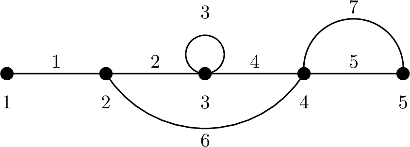

# C. Cacti Classification

**time limit per test:** 3 seconds

**memory limit per test:** 1024 megabytes

**input:** standard input

**output:** standard output

Ivan and Petr like to play with cacti — special graphs where each edge belongs to at most one simple cycle, and the graph is connected. Multiple edges between pairs of vertices and loops are allowed.

They invent the following game:

- Petr secretly builds a cactus with $n$ vertices and $m$ edges. The edges are labeled from $1$ to $m$.
- Petr only tells Ivan the number $m$.
- Ivan is then allowed to ask questions of the following form:

 - He chooses a subset $S$ of edge labels (see below about limitations on the subset), and asks: "If we only keep the edges whose labels are in $S$ (and all $n$ vertices), is the resulting graph connected?"
 - Petr must answer either "yes" or "no".


After asking at most $8m$ questions, Ivan must determine, for every edge:

- whether this edge lies on some cycle in the cactus;
- if it does, what is the length of that simple cycle.

In this problem, each loop is considered a simple cycle of length $1$ and two edges between the same pair of vertices form a simple cycle of length $2$.

However, Ivan is still very young and only knows numbers up to $14$. So:

- if an edge lies on a simple cycle of length at most $14$, he must output that exact length;
- if an edge lies on a simple cycle of length greater than $14$, he must say that this edge lies on a big cycle.

Also, to avoid having to list a lot of edges each time, Ivan always asks about an edge set obtained from the set used in one of the previous queries, or from the set of all edges, by removing exactly one edge.

Can you design a strategy that allows Ivan to complete this task?

#### Input

Each test contains multiple test cases. The first line contains the number of test cases $t$ ($1 \le t \le 100$). The description of the test cases follows.

The first line of each test case contains $m$ ($1 \le m \le 10^4$) — the number of edges in the cactus.

It is guaranteed that the sum of $m$ over all test cases does not exceed $10^4$.

#### Interaction

To ask a query, output a line in the following format (without the quotes):

- "? $p$ $e$" ($0 \le p \le q$; $1 \le e \le m$), where $p$ is the number of a previous query or zero (queries are numbered from 1 in the order they are asked), $q$ is the number of queries made before the current one, $e$ is the label an edge.

The query denotes a graph consisting of the edges used in the query number $p$ (or all edges if $p = 0$), with edge $e$ removed. The interactor checks whether this graph is connected when considering all original vertices and returns a single integer:

- $1$ if the graph denoted by the query is connected;
- $0$ if the graph denoted by the query is not connected;
- $-1$ if you have exceeded $8m$ allowed queries or edge $e$ was already removed from the set of edges used in query $p$. In this case you should terminate your program to receive a Wrong Answer verdict.

When you have found the answer, output a single line in the following format:

- "! $e_1$ $e_2$ $\dots$ $e_m$" ($-1 \le e_i \le 14$ for all $i$),
 where:

- if $e_i$ is positive, then edge number $i$ belongs to a simple cycle of length exactly $e_i$,
- if $e_i = 0$, then edge number $i$ belongs to a big cycle (simple cycle of length greater than $14$),
- if $e_i = -1$, then edge number $i$ does not belong to any cycle.

The interactor returns a single integer:

- $1$ if your answer is correct. Proceed to the next test case or terminate your program if this was the last case.
- $-1$ if your answer is incorrect. In this case you should terminate your program to receive a Wrong Answer verdict.

The interactor is not adaptive, meaning that the graph is fixed before you ask any queries.

#### Example

#### Input
```
1
7

0

1

1

1
```

#### Output
```
? 0 1

? 0 3

? 2 4

! -1 3 1 3 2 3 2
```

#### Note

In the example interaction, the input and output contain empty lines to align interactor responses with queries. These empty lines do not appear in the actual input and output.

In this example, the graph has $5$ vertices and $7$ edges; edges $1$ through $7$, in this order, are $(1, 2)$, $(2, 3)$, $(3, 3)$, $(3, 4)$, $(4, 5)$, $(2, 4)$, $(4, 5)$.



