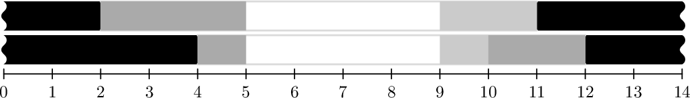

# D. Doorway

**time limit per test:** 3 seconds

**memory limit per test:** 1024 megabytes

**input:** standard input

**output:** standard output

The construction of the doorway for the Nonsense Engineering and Research Convention was delegated to one of the future attendees, who decided on a multi-layered sliding door design.

Each layer can be described as a horizontal interval, bounded by solid walls on the left and right, containing a number of sliding doors of fixed lengths. Within a layer, each door can move independently to the left or right, as long as it does not overlap other doors or the walls. All layers are parallel and stacked vertically.

After construction, the organizers noticed a problem: it is difficult to fully open the door, and since a large number of attendees are expected, they need to create the largest possible opening to allow everyone to pass through freely.

The size of the opening is defined as the total length of horizontal intervals such that, at every point of such an interval and in every layer, there is neither a door nor a wall. Your task is to determine the largest possible opening, given the doors' layout.

#### Input

The first line contains an integer $n$ ($1 \le n \le 100\,000$) — the number of layers of the door.

Each of the next $n$ lines starts with three integers $k_i$, $x_{i,1}$, $x_{i,2}$ ($0 \le k_i \le 300\,000$; $0 \le x_{i,1} \lt x_{i,2} \le 10^9$) — the number of sliding doors on that layer and the $x$-coordinates $x_{i,1}$ and $x_{i,2}$ of the walls on that layer. There is a wall at $x_{i,1}$ and a wall at $x_{i,2}$; all positions with $x \lt x_{i,1}$ or $x \gt x_{i,2}$ are blocked by walls.

They are followed by $k_i$ integers $l_{i,1}, \ldots, l_{i,k_i}$ ($1 \le l_{i,j}$; $\sum\limits_{j=1}^{k_i} l_{i,j} \le x_{i,2} - x_{i,1}$) — the lengths of the sliding doors on that layer given in order from the leftmost door to the rightmost.

It is guaranteed that $\sum\limits_{i=1}^{n} k_i \le 300\,000$.

#### Output

Output a single integer — the size of the largest possible opening that can be achieved by moving the sliding doors on each layer.

#### Examples

#### Input
```
2
2 2 11 3 2
3 4 12 1 1 2
```

#### Output
```
4
```

#### Input
```
2
2 0 7 2 4
1 4 9 4
```

#### Output
```
0
```

#### Note

This illustration shows a solution for the first example. Walls are filled with black color, doors are filled with various shades of grey, the opening is white. When first doors on each layer are shifted to the left and the rest of the doors to the right, we get the largest opening of 4.



