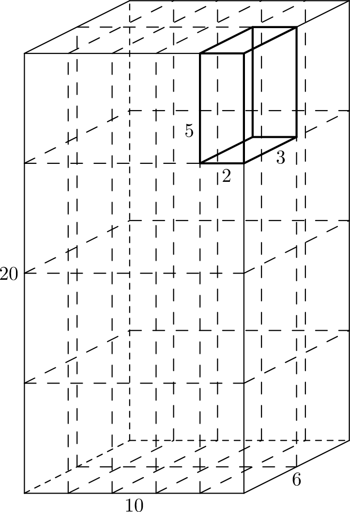

# H. Honey Cake

**time limit per test:** 3 seconds

**memory limit per test:** 1024 megabytes

**input:** standard input

**output:** standard output

Hannah and Henry are going to host a party for $n$ people, including themselves.

They bought a honey cake of size $w \times h \times d$ inches for the party, and want to split it into $n$ equal pieces.

The honey cake can be cut parallel to any of its faces. To make cuts precise, each edge of length $w$ is cut into the same number of equal parts, each having integer length; similarly for edges of lengths $h$ and $d$.

Given the dimensions of the honey cake, determine whether it is possible to cut it into $n$ equal pieces, and if so, how.

#### Input

The first line of input contains three integers: $w$, $h$, and $d$, the dimensions of the honey cake in inches ($1 \le w, h, d \le 10^9$).

The second line contains a single integer $n$ ($1 \le n \le 10^9$).

#### Output

Output three integers $w_c$, $h_c$, $d_c$, the number of cuts to be made along each of the dimensions $w$, $h$, and $d$, respectively, if it is possible to cut the cake, or a single integer $-1$ otherwise. Note that making zero cuts along a dimension is allowed, too.

#### Example

#### Input
```
10 20 6
40
```

#### Output
```
4 3 1
```

#### Note

In the first example, the cake will be cut into $5 \cdot 4 \cdot 2 = 40$ pieces of size $2 \times 5 \times 3$ inches.



