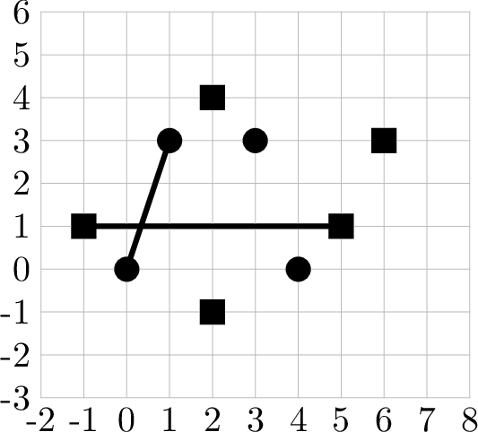
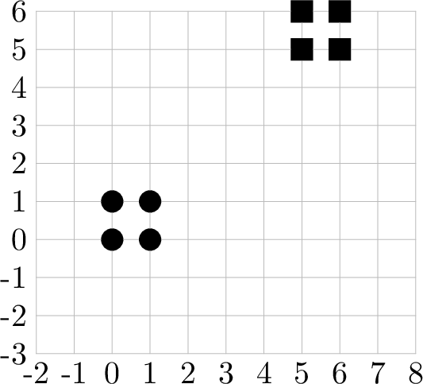
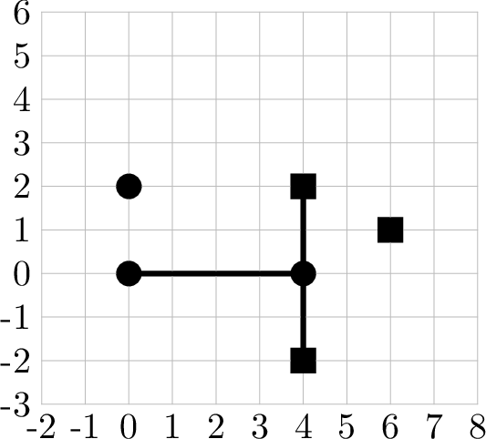
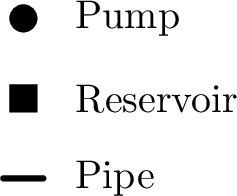

# I. Irrigation Interlock

**time limit per test:** 3 seconds

**memory limit per test:** 1024 megabytes

**input:** standard input

**output:** standard output

Two irrigation cooperatives share the same fertile valley. The first cooperative maintains pumps scattered across the fields; the second supervises reservoirs on the surrounding hills. Whenever both cooperatives decide to lay a pair of new pipes, the pipes must intersect — at such an intersection they can install a joint valve. Pipes always follow a straight line segment between a pair of distinct pumps or a pair of distinct reservoirs. Two pipes intersect if they share at least one common point (touching and overlapping pipes are considered intersecting).

You are given the exact coordinates of every pump and every reservoir on a Cartesian plane. For each planning scenario, determine whether the first cooperative can pick two distinct pumps and the second cooperative can pick two distinct reservoirs so that the two straight pipes intersect. If this is possible, report the indices of those pumps and reservoirs; otherwise declare that the project cannot be realized.

#### Input

The first line contains an integer $t$ ($1 \le t \le 10^5$) — the number of planning scenarios.

For each planning scenario:

The first line contains an integer $n$ ($2 \le n \le 10^5$) — the number of pumps managed by the first cooperative.

Each of the next $n$ lines contains two integers $x_i$ and $y_i$ ($|x_i|, |y_i| \le 10^9$) — the Cartesian coordinates of pump $i$. The pump locations are distinct.

The next line contains an integer $m$ ($2 \le m \le 10^5$) — the number of reservoirs managed by the second cooperative.

Each of the next $m$ lines contains two integers $u_j$ and $v_j$ ($|u_j|, |v_j| \le 10^9$) — the Cartesian coordinates of reservoir $j$. The reservoir locations are distinct.

No pump shares its location with any reservoir.

It is guaranteed that the sum of $n$ over all planning scenarios does not exceed $2 \cdot 10^5$ and the sum of $m$ over all planning scenarios does not exceed $2 \cdot 10^5$.

#### Output

For each planning scenario:

If the first cooperative can choose two pumps and the second cooperative can choose two reservoirs so that the straight pipes connecting each pair intersect, output four integers $p_1$, $p_2$, $r_1$, $r_2$ — the indices of two chosen pumps ($1 \le p_1, p_2 \le n$; $p_1 \ne p_2$) and two chosen reservoirs ($1 \le r_1, r_2 \le m$; $r_1 \ne r_2$).

If such an intersection is impossible, output $-1$.

In case several valid solutions exist, any one of them is acceptable.

#### Example

#### Input
```
3
4
0 0
4 0
3 3
1 3
5
-1 1
5 1
2 -1
2 4
6 3
4
0 0
1 0
0 1
1 1
4
5 5
6 5
5 6
6 6
3
0 0
4 0
0 2
3
4 -2
4 2
6 1
```

#### Output
```
1 4 1 2
-1
1 2 1 2
```

#### Note







Planning scenario 1Planning scenario 2Planning scenario 3


