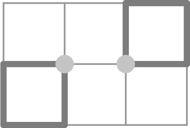
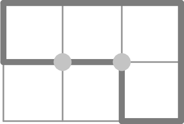
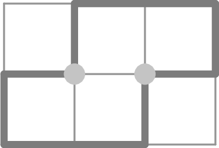
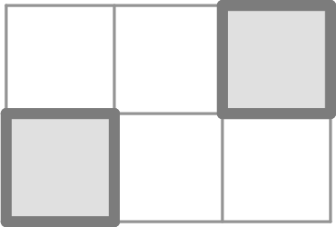
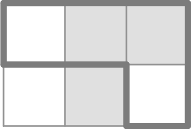

# K. Knit the Grid

**time limit per test:** 3 seconds

**memory limit per test:** 1024 megabytes

**input:** standard input

**output:** standard output

The voodoo lady once knitted a magical tapestry. Initially, she took a blank canvas that can be represented as an $r \times c$ grid with $r$ rows and $c$ columns, thus having $(r + 1) \times (c + 1)$ grid points. Then she did the following operation some number of times: she knitted a cycle on the canvas along the grid lines, passing through each grid point at most once within that cycle. Additionally, no two cycles share any grid point.

In the end, it turned out that exactly one cycle passes through each of the $(r-1) \cdot (c-1)$ inner grid points that don't lie on the canvas' border. Here are some examples of cycle arrangements for $r=2$, $c=3$ with the inner grid points highlighted:









Then she left the canvas on the floor overnight. During the night, $r\cdot c$ green frogs hopped on the canvas, with one sitting in each cell. But that was only the beginning of the voodoo lady's troubles! Because then, the old witch came to the canvas, and one-by-one, ripped away every knitted line on the canvas. Every time she ripped away a knitted line segment between two adjacent grid points, the frogs in the cells adjacent to that line segment got startled (there were one or two startled frogs, depending on whether the line segment was on a border or not). When a frog got startled, it instantly changed its color: if the frog was green, it became brown; and if it was brown, it became green again.

If the cycles were arranged as in the pictures above, then the colors would be as follows (greyed out cells represent green frogs and white cells represent brown ones):







When the voodoo lady came back to her canvas, she only saw that there were frogs of two colors on her canvas, but no knitted cycles. From the given arrangement of the frog colors, determine whether it could have been produced by the described process, and if so, help the voodoo lady to restore a possible arrangement of cycles.

#### Input

Each test contains multiple test cases. The first line contains the number of test cases $t$ ($1 \le t \le 10^4$). The description of the test cases follows.

The first line of each test case contains two integers $r$ and $c$, denoting the dimensions of the grid ($2 \le r, c \le 10^3$).

Each of the next $r$ lines contains a string consisting of $c$ characters G or B denoting green and brown frogs respectively.

It is guaranteed that the sum of $r \cdot c$ over all test cases does not exceed $2 \cdot 10^6$.

#### Output

For each test case, on the first line output "YES" if the given frog colors could have been produced by the described process, and "NO" otherwise.

If the answer is YES, output $2r+1$ more lines with binary strings (with 0 and 1 characters). The first $r+1$ of those lines should have length $c$ each and represent the horizontal grid line segments and the next $r$ lines have length $c+1$ each and represent the vertical grid line segments of the answer as explained below.

In the first $r+1$ lines $j$-th character of the $i$-th line is 1 if the horizontal grid line segment that is $j$-th from the left and $i$-th from the top should have a knitted line along it, and 0 otherwise.

In the next $r$ lines $j$-th character of the $i$-th line is 1 if the vertical grid line segment that is $j$-th from the left and $i$-th from the top should have a knitted line along it, and 0 otherwise.

#### Example

#### Input
```
3
2 3
BBG
GBB
3 3
GGG
GGG
GGG
3 3
GGG
BBB
GGG
```

#### Output
```
YES
001
101
100
0011
1100
YES
111
010
010
111
1001
1111
1001
NO
```

#### Note

The first test case is the first example of a cycle arrangement from the statement.

In the second sample test case, the output shown in the sample is illustrated in the first picture below. The cycle arrangement in the second picture is also correct, while in the third picture it is not, because some grid points are shared by more than one cycle. Leaving the grid empty would also not be correct, because there would be no cycle passing through inner grid points.


