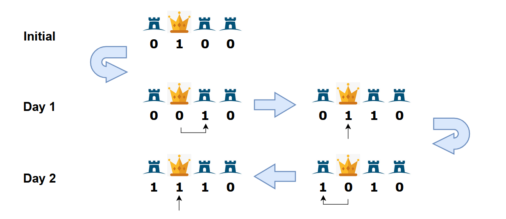

# C. War Strategy

**time limit per test:** 2 seconds

**memory limit per test:** 256 megabytes

**input:** standard input

**output:** standard output

A war has broken out! You, as the country's top general, must strategize where to place your troops.

There are $n$ bases in a line, with the $k$-th of which being the home base for your army. Initially, there is only a single soldier at base $k$. Each day, the following happens in order:

- You give out an order by choosing a base $i$ ($1 \leq i \leq n$), and any number of soldiers inside that base (which is allowed to be $0$ or all soldiers in that base currently). Then, tell all soldiers you ordered to either move to base $i-1$ or base $i+1$. All soldiers must move in the same direction, and no soldier is allowed to move to the left of base $1$ or to the right of base $n$.
- Then, a new soldier moves onto base $k$. This soldier cannot be ordered by that day's commands.

However, time is tight, and there are only $m$ days until the enemy attacks. A base is called fortified if at least one soldier resides in it. Your job is to find the maximum number of fortified bases (including the home base) you can have by the end of the $m$-th day.

#### Input

Each test contains multiple test cases. The first line contains the number of test cases $t$ ($1 \le t \le 10^4$). The description of the test cases follows.

The first line of each test case contains three integers $n$, $m$, $k$ ($1 \leq k \leq n \leq 10^5$, $1 \leq m \leq 10^9$) — denoting the number of bases, the number of days you have to fortify your bases, and the index of the home base.

It is guaranteed that the sum of $n$ across all test cases does not exceed $2\cdot 10^5$.

#### Output

For each test case, print the maximum number of bases you can fortify at the end of the $m$-th day.

#### Example

#### Input
```
7
3 1 3
3 3 2
4 2 2
3 2 1
4 3 3
7 7 4
100000 1000000000 100000
```

#### Output
```
2
3
3
2
3
6
100000
```

#### Note

In the second test case, here is one way to fortify $3$ bases:

- On the first day, order $0$ soldiers in base $3$ to move to base $2$. At the end of the day, a new soldier moves to base $2$ (there are now $2$ soldiers in base $2$ and $0$ soldiers on any other base).
- On the second day, order $1$ soldier in base $2$ to move to base $1$. At the end of the day, a new soldier moves to base $2$. There are now $2$ soldiers in base $2$ and $1$ soldier on base $1$.
- On the third day, order $2$ soldiers in base $2$ to move to base $3$. At the end of the day, a new soldier moves to base $2$. There are now $1$ soldier in base $1$ and $2$, and $2$ soldiers in base $3$.
- There is now at least one soldier in each of bases $1$, $2$, $3$. Therefore, the answer is $3$.

In the third test case, here is one way you can achieve $3$ bases being fortified:

- On the first day, order the existing soldier to move from base $2$ to base $3$. At the end of the day, a new soldier moves to base $2$.
- On the second day, order the soldier in base $2$ to move to base $1$. At the end of the day, a new soldier moves to base $2$.
- There is now a soldier at each of bases $1,2,3$. Therefore, the answer is $3$. It can be shown we cannot have more than $3$ fortified bases by the end of day $2$.

Below is a vivid explanation of the third test case.



