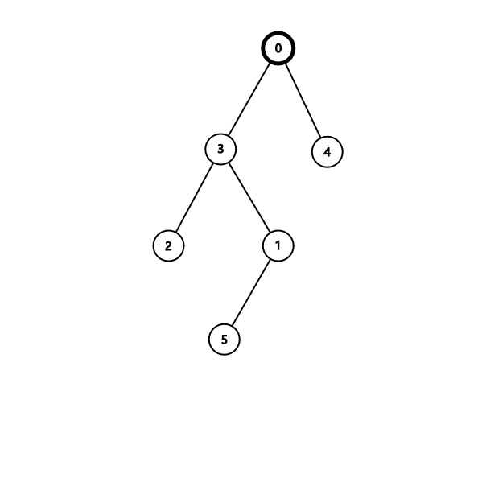

# F1. Al Fine (Maximizing Version)

**time limit per test:** 3 seconds

**memory limit per test:** 512 megabytes

**input:** standard input

**output:** standard output


This is the maximizing version of the problem. The difference between the versions is that in this version, you need to find the maximum possible depth among all common trees. Also, the constraint on $n$ in this version is larger. You can hack only if you solved all versions of this problem.

For Christmas, Tortinita and Arietta each get a Christmas tree. Coincidentally, their trees share the same properties: both have $n+1$ vertices and are rooted at vertex $0$. In their Christmas card to you, each of them appends a DFS order sequence of their tree after their greetings. Recall that a DFS order sequence is generated by the following pseudocode.
```python
dfs_order = []

def dfs(v):
 dfs_order.append(v)
 pick an arbitrary permutation s of children of v
 for child in s:
 dfs(child)

dfs(root)
```

Let the DFS order sequence of Tortinita's tree be $a_0, a_1, \ldots, a_n$ and that of Arietta's tree be $b_0, b_1, \ldots, b_n$. You observe that $a_0 = b_0 = 0$, and since they are twin sisters, you wonder if they could have the exact same tree. You also feel that for their Christmas tree, the sisters would not choose a trivial structure. Therefore, you want to find the maximum possible depth$^{\text{∗}}$ among all common trees for both sequences.

$^{\text{∗}}$The depth of a tree is defined as the maximum number of edges on a simple path from any node to the root.

#### Input

Each test contains multiple test cases. The first line contains the number of test cases $t$ ($1 \le t \le 10^4$). The description of the test cases follows. 

The first line of each test case contains one integer $n$ ($2 \le n \le 10^6$).

The second line of each test case contains $n$ integers $a_1, a_2, \cdots, a_n$ ($1 \le a_i \le n$).

The third line of each test case contains $n$ integers $b_1, b_2, \cdots, b_n$ ($1 \le b_i \le n$).

It is guaranteed that neither sequence $a$ nor $b$ contains duplicates.

It is guaranteed that the sum of $n$ over all test cases does not exceed $10^6$. 

#### Output

For each test case, output one integer — the maximum possible depth among all common trees.

#### Example

#### Input
```
4
2
1 2
1 2
2
1 2
2 1
5
3 1 5 2 4
4 3 2 1 5
5
2 3 4 1 5
3 2 1 4 5
```

#### Output
```
2
1
3
1
```

#### Note

In the first test case, $a$ and $b$ are the same. Consider a link tree with edges $(0,1)$ and $(1,2)$; it can give either DFS order sequence, and its depth is $2$. It can be shown that $2$ is the maximum depth among all possible common trees.

In the second test case, consider a star-shaped tree with edges $(0,1)$ and $(0,2)$, whose depth is $1$. It can be shown that $1$ is the maximum depth among all possible common trees.

In the third test case, the figure shows one of the trees with the maximum depth of $3$.
 


