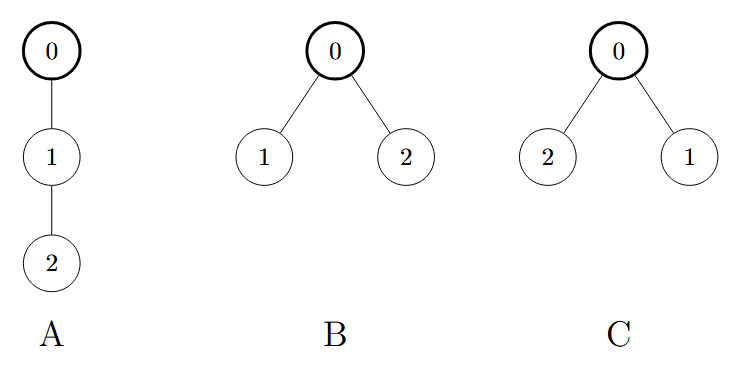

# F2. Al Fine (Counting Version)

**time limit per test:** 2 seconds

**memory limit per test:** 256 megabytes

**input:** standard input

**output:** standard output


This is the counting version of the problem. The difference between the versions is that in this version, you need to find the number of different common trees. Also, the constraint on $n$ in this version is smaller. You can hack only if you solved all versions of this problem.

For Christmas, Tortinita and Arietta each get a Christmas tree. Coincidentally, their trees share the same properties: both have $n+1$ vertices and are rooted at vertex $0$. In their Christmas card to you, each of them appends a DFS order sequence of their tree after their greetings. Recall that a DFS order sequence is generated by the following pseudocode.
```python
dfs_order = []

def dfs(v):
 dfs_order.append(v)
 pick an arbitrary permutation s of children of v
 for child in s:
 dfs(child)

dfs(root)
```

Let the DFS order sequence of Tortinita's tree be $a_0, a_1, \ldots, a_n$ and that of Arietta's tree be $b_0, b_1, \ldots, b_n$. You observe that $a_0 = b_0 = 0$, and since they are twin sisters, you wonder if they could have the exact same tree. Therefore, you want to find the number of different common trees$^{\text{∗}}$ for both sequences. Since the answer may be very large, you need to output it modulo $998\,244\,353$.

$^{\text{∗}}$Two trees are considered different if there exists a vertex label for which the set of its children's labels is not identical in both trees. In other words, the ordering of children for any given vertex does not matter.

#### Input

Each test contains multiple test cases. The first line contains the number of test cases $t$ ($1 \le t \le 10^4$). The description of the test cases follows. 

The first line of each test case contains one integer $n$ ($2 \le n \le \boldsymbol{5000}$).

The second line of each test case contains $n$ integers $a_1, a_2, \cdots, a_n$ ($1 \le a_i \le n$).

The third line of each test case contains $n$ integers $b_1, b_2, \cdots, b_n$ ($1 \le b_i \le n$).

It is guaranteed that neither sequence $a$ nor $b$ contains duplicates.

It is guaranteed that the sum of $n^2$ over all test cases does not exceed $2.5\cdot10^7$. 

#### Output

For each test case, output one integer — the number of different common trees modulo $998\,244\,353$.

#### Example

#### Input
```
4
2
1 2
1 2
2
1 2
2 1
5
3 5 1 2 4
3 1 5 4 2
5
2 1 4 5 3
2 4 1 5 3
```

#### Output
```
2
1
3
7
```

#### Note

In the first test case, the two different trees are tree A and tree B in the figure below. Note that tree B and tree C are the same.

In the second test case, the only common tree is tree B.
 


