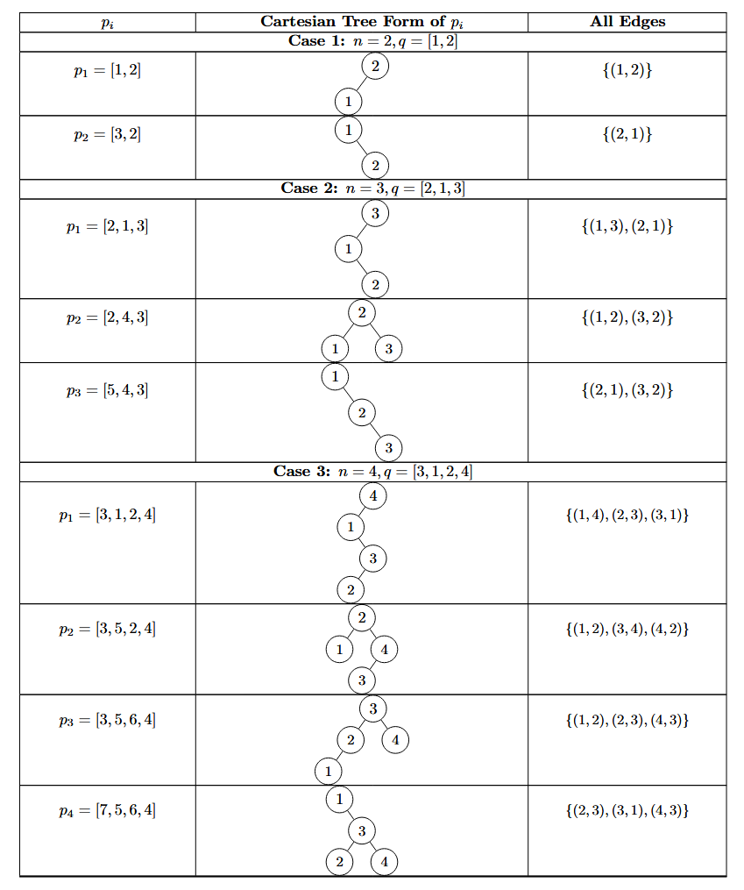

# G. Many Cartesian Trees

**time limit per test:** 2 seconds

**memory limit per test:** 256 megabytes

**input:** standard input

**output:** standard output


Consider an array $a$ consisting of $n$ distinct integers. The Cartesian Tree of $a$ is defined as a unique binary tree$^{\text{∗}}$ that satisfies the following conditions:

- The tree consists of $n$ vertices labeled from $1$ to $n$;
- For all pairs of vertices $(i,j)$ such that $i$ is a parent$^{\text{†}}$ of $j$, $a_i \gt a_j$;
- For any vertex $i$, all vertices in the left subtree$^{\text{‡}}$ of $i$ have labels less than $i$;
- For any vertex $i$, all vertices in the right subtree of $i$ have labels greater than $i$.

Denote $r(a)$ as the root of the Cartesian Tree, and $f_a(i)$ as the parent of $i$ in the Cartesian Tree.

Define $E_a=\{(i,f_a(i)) \mid 1 \le i \le n, i \ne r(a)\}$.

Consider a permutation$^{\text{§}}$ $q$ of length $n$. We define a series of arrays $p_1,p_2,\ldots,p_n$ as follows:

- $p_1=q$;
- For each $2 \le i \le n$, $p_i$ is obtained by incrementing the minimum element in $p_{i-1}$ by $n$. It can be shown that all elements in $p_i$ are distinct.

You are now given $n$ and $S=\bigcup\limits_{i=1}^n E_{p_i}$. To minimize input, $S$ will be given in the form of a $n \times n$ binary matrix $s$. Denote $s_{i,j}$ as the $j$-th character of the $i$-th row. $s_{i,j}=1$ if and only if $(i,j) \in S$.

Please find any permutation $q$ such that $S$ can be obtained by the process above. It is guaranteed that the tests are generated to ensure a valid $q$ always exists.

$^{\text{∗}}$A binary tree is a rooted tree, in which each node has no more than $2$ children, referred to as the left child and the right child.

$^{\text{†}}$The parent of vertex $v$ is the first vertex on the simple path from $v$ to the root. The root has no parent.

$^{\text{‡}}$A subtree of vertex $v$ is the subgraph of $v$, all its descendants, and all the edges between them.

$^{\text{§}}$A permutation of length $n$ is an array consisting of $n$ distinct integers from $1$ to $n$ in arbitrary order. For example, $[2,3,1,5,4]$ is a permutation, but $[1,2,2]$ is not a permutation ($2$ appears twice in the array), and $[1,3,4]$ is also not a permutation ($n=3$ but there is $4$ in the array).

#### Input

Each test contains multiple test cases. The first line contains the number of test cases $t$ ($1 \le t \le 10^4$). The description of the test cases follows.

The first line of each test contains an integer $n$ ($2 \le n \le 3000$) — the length of $q$ that you need to find.

The $i$-th of the next $n$ lines contains a binary string of length $n$, representing the $i$-th row of $s$. It is guaranteed that $s_{i,i} = 0$ for all $1 \le i \le n$.

It is guaranteed that the tests are generated to ensure a valid $q$ always exists.

It is guaranteed that the sum of $n^2$ over all test cases does not exceed $9 \cdot 10^6$.

#### Output

For each test case, output $n$ integers $q_1,q_2,\ldots,q_n$, representing the permutation $q$ you found.

#### Example

#### Input
```
3
2
01
10
3
011
100
010
4
0101
0010
1001
0110
```

#### Output
```
1 2
2 1 3
3 1 2 4
```

#### Note



