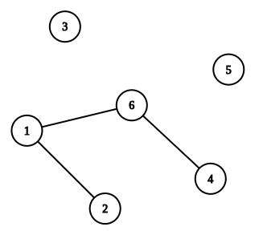
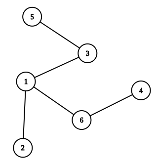

# D. Prufer Vertex

**time limit per test:** 2 seconds

**memory limit per test:** 256 megabytes

**input:** standard input

**output:** standard output


For a tree $T$ with $n \ge 2$ vertices, consider the standard process for generating its [Prufer sequence](<https://en.wikipedia.org/wiki/Prufer_sequence>). We repeatedly perform the following steps until only two vertices remain:

- Select the leaf with the smallest label;
- Remove it from the tree.

It is known that vertex $n$ is always one of the two remaining vertices. Let $v$ be the other remaining vertex. We define the Prufer vertex of $T$ as $P(T) = v$.

You are given a forest with $n$ vertices and $m$ edges. Let $k$ be the number of connected components in this forest, and let their sizes be $s_1, s_2, \ldots, s_k$. It is known that there are exactly $n^{k - 2} \prod\limits_{i=1}^k s_i$ ways to add edges to the forest so that it becomes a single tree.

For each $v$ ($1 \le v \lt n$), calculate how many of these ways result in a tree $T$ satisfying $P(T) = v$.

Since the answers can be large, print them modulo $998\,244\,353$.

#### Input

Each test contains multiple test cases. The first line contains the number of test cases $t$ ($1 \le t \le 10^4$). The description of the test cases follows.

The first line of each test case contains two integers $n$ and $m$ ($2 \le n \le 2 \cdot 10^5$, $0 \le m \le n - 1$) — the number of vertices and edges in the forest, respectively.

The next $m$ lines of each test case contain two integers $u$ and $v$ ($1 \le u, v \le n, u \neq v$), describing an edge between vertices $u$ and $v$. It is guaranteed that these edges form a forest (that is, the graph is acyclic).

It is guaranteed that the sum of $n$ over all test cases does not exceed $2 \cdot 10^5$.

#### Output

For each test case, print $n - 1$ integers on a single line. The $i$-th integer should be the number of ways to add edges to the forest so that it becomes a tree $T$ satisfying $P(T) = i$, modulo $998\,244\,353$.

#### Example

#### Input
```
3
3 0
5 4
4 2
3 4
1 2
4 5
6 3
1 6
6 4
2 1
```

#### Output
```
1 2 
0 0 0 1 
12 0 1 6 5 
```

#### Note

In the first example, there are no edges in the forest, and there are $3$ ways to complete it to a tree. One of them is to add edges $(1, 2)$ and $(1, 3)$. There are $2$ leaves: vertex $2$ and $3$. Since $2$ has a smaller label, it gets deleted from the tree, and only two vertices remain: $1$ and $3$. Therefore, the Prufer vertex of this tree is $1$.

In the third example, the forest is shown below:



Suppose we add edges $(3, 5)$ and $(3, 1)$ to complete it to a tree $T$. It is going to look like this:



It can be shown that $P(T) = 1$.
