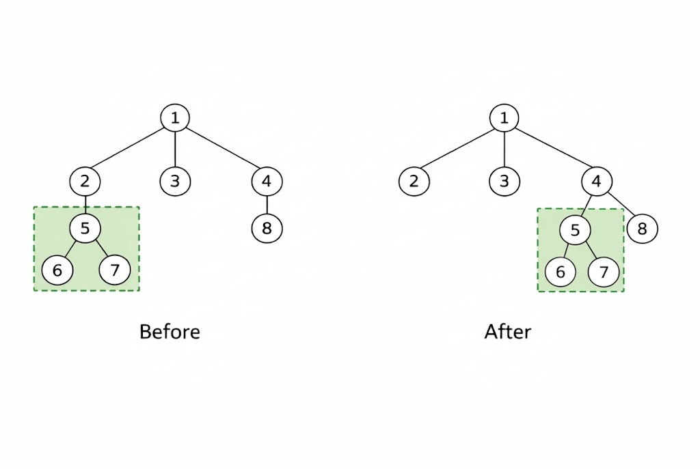

# D. Cost of Tree

**time limit per test:** 3 seconds

**memory limit per test:** 256 megabytes

**input:** standard input

**output:** standard output

For a tree $T$ with root $r$, where each node $u$ has a value $a_u$ associated with it, the cost of the tree defined as:

$$\sum_{u\in T} (a_u \cdot d(r,u))$$

Here, this sum is taken over all nodes $u$ in the tree $T$, and $d(r,u)$ denotes the number of edges on the shortest path from node $r$ to node $u$ on a tree.

You are given a tree consisting of $n$ nodes, rooted at node $1$. Each node $i$ has a value $a_i$ assigned to it. For each $r$ from $1$ to $n$, please solve the following problem independently:

Consider the subtree of node $r$ with respect to node $1$. Formally, the subtree of node $r$ is the tree consisting of all nodes $u$ such that the shortest path from $1$ to $u$ contains $r$.

Find the maximum cost of the subtree after performing at most one operation of the following type on the subtree:

- Choose any node $u$ ($u \neq r$). Remove the edge from $u$ to the parent of node $u$$^{\text{∗}}$. Then, add an edge from $u$ to any node $v$ that is still reachable from $r$. It can be shown that after this operation, the graph remains a tree.
 As an example, below shows an example of an operation with $r=1$,$u=5$, and $v=4$.




$^{\text{∗}}$Formally, remove the edge from $u$ to $p$, where $p$ is the unique node satisfying $d(u,p)=1$ and $d(u,r)=d(p,r)+1$

#### Input

Each test contains multiple test cases. The first line contains the number of test cases $t$ ($1 \le t \le 10^4$). The description of the test cases follows.

The first line of each testcase contains a single integer $n$ ($1 \le n \le 2 \cdot 10^5$) — the count of nodes in the tree.

The second line of each testcase contains $n$ integers $a_1, a_2, \ldots, a_n$ ($1 \le a_i \le 2 \cdot 10^5$).

Then $n − 1$ lines follow, the $i$-th line containing two integers $u$ and $v$ ($1 \le u, v \le n$) — the two nodes that the $i$-th edge connects.

It is guaranteed that the given edges form a tree.

It is guaranteed that the sum of $n$ does not exceed $2 \cdot 10^5$ over all test cases.

#### Output

For each test case, print $n$ numbers – the answers for $r=1,2,\ldots,n$.

#### Example

#### Input
```
3
5
1 3 2 1 2
1 2
2 3
3 4
3 5
7
1 2 3 1 3 2 1
1 2
2 3
3 4
4 5
4 6
3 7
5
5 4 3 2 1
1 2
2 3
3 4
4 5
```

#### Output
```
18 10 5 0 0 
40 28 18 8 0 0 0 
20 10 4 1 0 
```

#### Note

In the first test case, for $r=1$, it is optimal to choose $u=5$ and $v=4$. The cost of the tree is then $1\cdot 0 + 3\cdot 1+2\cdot 2+1\cdot 3+2\cdot 4=18$. It can be shown that a larger cost cannot be obtained over all legal operations.

For $r=4$ for example, there is only $1$ node in the subtree, so there is no operation possible. The only possible cost of the subtree is $0$.
