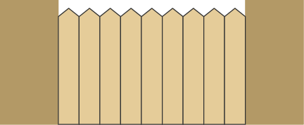
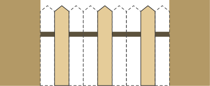
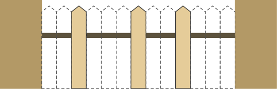

# A. Lawn Mower

**time limit per test:** 1 second

**memory limit per test:** 256 megabytes

**input:** standard input

**output:** standard output

The exit from the summer cottage is fenced with a fence consisting of $n$ boards, each $1$ meter wide. To the left and right of the exit are the fences of other plots. Some of the boards of the fence want to be removed for the construction of a bathhouse (possibly all or none), while there is an automatic lawn mower on the plot that is $w$ meters wide and must not leave the plot through a hole in the fence.

The lawn mower will be able to exit the plot if there are at least $w$ consecutive removed boards among the numbers of the removed boards. Determine the maximum number of boards that can be removed from the fence.

#### Input

Each test contains multiple test cases. The first line contains the number of test cases $t$ ($1 \le t \le 10^4$). The description of the test cases follows.

The only line of each test case contains two integers $n$ and $w$ ($1 \leq n \leq 10^{9}$, $1 \leq w \leq 10^{9}$) — the number of boards in the fence and the width of the lawnmower in meters, respectively.

#### Output

For each test case, output a single number — the maximum number of boards that can be removed from the fence.

#### Example

#### Input
```
5
9 3
13 4
15 14
20 1
1000 42
```

#### Output
```
6
10
14
0
977
```

#### Note

In the first test case, the fence consists of $9$ boards.





You can remove $6$ boards and leave only the boards numbered $2$, $5$, and $8$. Then the lawn mower will not be able to leave the boundaries of the territory.





In the second test case, you can remove $10$ boards, a possible arrangement is shown below.



