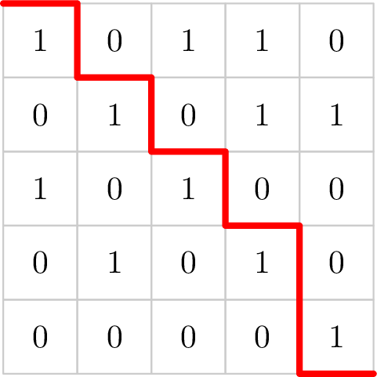
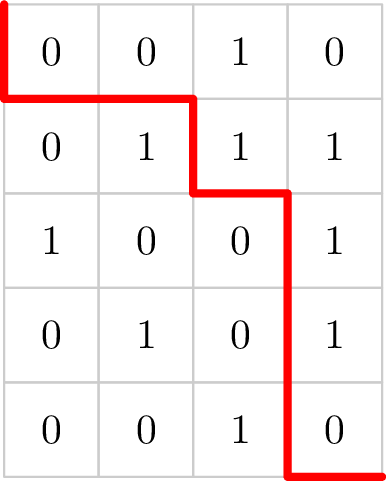

# D. Table Cut

**time limit per test:** 2 seconds

**memory limit per test:** 256 megabytes

**input:** standard input

**output:** standard output

Given a table of size $n \times m$, where each cell contains either $0$ or $1$. The task is to divide it into two parts with a cut that goes from the top left corner to the bottom right corner. The cut lines can only go right or down.

Let $a$ be the number of ones in one part of the table after the cut, and $b$ be the number of ones in the other part of the table. The goal is to maximize the value of $a \cdot b$.

#### Input

Each test contains multiple test cases. The first line contains the number of test cases $t$ ($1 \le t \le 10^4$). The description of the test cases follows.

The first line of each test case contains two integers $n$ and $m$ ($1 \leq n, m \leq 3 \cdot 10^{5}$, $2 \leq n \cdot m \leq 3 \cdot 10^{5}$) — the number of rows and columns in the table, respectively.

Each of the following $n$ lines contains $m$ integers, where the $j$-th number in the $i$-th line corresponds to the value $a_{i, j}$ ($0 \leq a_{i, j} \leq 1$).

It is guaranteed that the sum of $n \cdot m$ across all test cases does not exceed $3 \cdot 10^{5}$.

#### Output

For each test case, output a single number in the first line of the output data — the maximum value of the product.

In the second line, output a string consisting of $n$ characters  'D' and $m$ characters  'R', representing the direction of the next cut, where 'D' means a cut downwards, and 'R' — a cut to the right.

#### Example

#### Input
```
3
5 5
1 0 1 1 0
0 1 0 1 1
1 0 1 0 0
0 1 0 1 0
0 0 0 0 1
5 4
0 0 1 0
0 1 1 1
1 0 0 1
0 1 0 1
0 0 1 0
3 2
1 0
0 1
1 1
```

#### Output
```
30
RDRDRDRDDR
20
DRRDRDDDR
4
DRDRD
```

#### Note

The images show the correct cuts for each of the first and second test cases, at which the maximum value of the product is achieved.






