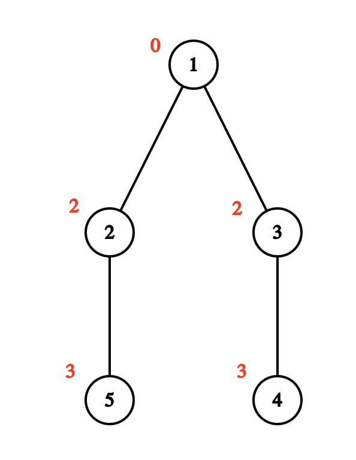

# F1. Again Trees... (Easy Version)

**time limit per test:** 1 second

**memory limit per test:** 1024 megabytes

**input:** standard input

**output:** standard output


This is the easy version of the problem. The difference between the versions is that in this version, $k \leq 4$. You can hack only if you solved all versions of this problem.

Given a tree consisting of $n$ vertices. Each vertex has a non-negative integer $a_v$ written on it. You are also given $k$ distinct non-negative integers $b_1, \ldots, b_k$.

We will call a set of edges beautiful if, after removing these edges from the tree, the tree splits into connected components, where in each component the bitwise XOR of all the numbers $a_v$ in that component belongs to the set $b$.

You need to count the number of beautiful sets of edges in the tree modulo $10^9 + 7$.

#### Input

Each test contains multiple test cases. The first line contains the number of test cases $t$ ($1 \le t \le 500$). The description of the test cases follows.

The first line of each dataset contains two integers $n$ and $k$ ($2 \leq n \leq 10^5$, $1 \leq k \leq 4$) — the number of vertices in the tree and the size of the set $b$.

The next $n - 1$ lines describe the edges of the tree. The $i$-th line contains two integers $v_i$ and $u_i$ ($1 \leq v_i, u_i \leq n$) — the numbers of the vertices connected by the $i$-th edge.

The next line contains $n$ integers $a_1, a_2, \ldots, a_n$ ($0 \leq a_i \lt 2^{30}$) — the values written on the vertices.

The following line contains $k$ distinct integers $b_1, b_2, \ldots, b_k$ ($0 \leq b_i \lt 2^{30}$) — the elements of the set $b$.

It is guaranteed that the sum of $n$ across all datasets does not exceed $10^5$.

#### Output

For each test dataset, output a single integer — the answer to the problem.

#### Example

#### Input
```
4
5 1
1 2
1 3
3 4
2 5
0 2 2 3 3
1
5 1
4 5
1 2
3 1
3 5
0 0 2 0 2
0
5 2
1 2
1 3
3 4
2 5
0 2 2 3 3
1 3
4 1
1 2
2 3
3 4
1 1 1 1
1
```

#### Output
```
2
8
4
3
```

#### Note

Illustration for the first test dataset. In it, you can remove the edge between vertices $1$ and $2$. Then the bitwise XOR in the component consisting of vertices $2$ and $5$ is $a_2 \oplus a_5 = 2 \oplus 3 = 1$. The bitwise XOR in the component with vertices $1$, $3$, and $4$ is $a_1 \oplus a_3 \oplus a_4 = 0 \oplus 2 \oplus 3 = 1$. The second beautiful set is the one consisting of the edge connecting vertices $1$ and $3$.





In the third test dataset, the beautiful sets will be (an edge is denoted by the pair of vertices it connects) $[(1, 2)], [(1, 3)], [(2, 5)], [(3, 4)]$. Note that the first and third samples differ only in the set $b$.

In the fourth test dataset, the beautiful sets will be $[(1, 2)], [(3, 4)], [(1, 2), (2, 3), (3, 4)]$.
