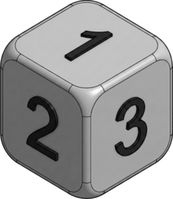

# C. Dice Roll Sequence

**time limit per test:** 2 seconds

**memory limit per test:** 256 megabytes

**input:** standard input

**output:** standard output

Consider the following cube $D$ where numbers $x$ and $7-x$ lie on opposite sides:




 Image generated by Nano Banana Pro.
A sequence $b$ of integers from $1$ to $6$ is called a dice roll sequence if it satisfies the following condition:

- All pairs of adjacent elements lie on adjacent$^{\text{∗}}$ sides of the cube.

For example, $[1,4,2]$ is a dice roll sequence, while $[3,4,6,3]$ is not because $3$ and $4$ are not on adjacent sides of the dice. Additionally, $[2,2,4]$ is not a dice roll sequence because $2$ and $2$ are on the same (not adjacent) side of the dice.

Given a sequence $a$ of $n$ integers from $1$ to $6$, you can perform the following operation any number of times (possibly zero).

- Select an index $1 \le i \le n$ and an integer $1 \le x \le 6$. Then, change the value of $a_i$ to $x$.

Please determine the minimum number of operations required to make $a$ a dice roll sequence.

$^{\text{∗}}$Two sides of the cube $S$ and $T$ are called adjacent if they share exactly one edge of the cube. Do note that this condition implies $S \neq T$ as well.

#### Input

Each test contains multiple test cases. The first line contains the number of test cases $t$ ($1 \le t \le 10^4$). The description of the test cases follows.

The first line of each test case contains a single integer $n$ ($1 \le n \le 3 \cdot 10^5$).

The second line of each test case contains $n$ integers $a_1,a_2,\ldots,a_n$ ($1 \le a_i \le 6$).

It is guaranteed that the sum of $n$ over all test cases does not exceed $3 \cdot 10^5$.

#### Output

For each test case, output the minimum number of operations required to make $a$ a dice roll sequence.

#### Example

#### Input
```
3
3
1 4 2
4
3 4 6 3
10
6 1 4 3 1 3 2 5 4 4
```

#### Output
```
0
1
4
```

#### Note

For the first test case, the sequence $a$ is $[1,4,2]$. As this is already a dice roll sequence, the answer is $0$.

For the second test case, the sequence $a$ is $[3,4,6,3]$.

Changing exactly one element, you can get $[3,\color{red}{5},6,3]$, which is a dice roll sequence.

For the third test case, the sequence $a$ is $[6,1,4,3,1,3,2,5,4,4]$.

Changing exactly $4$ elements, you can get $[\color{red}{5},1,4,\color{red}{2},1,3,2,\color{red}{1},\color{red}{5},4]$, which is a dice roll sequence.
