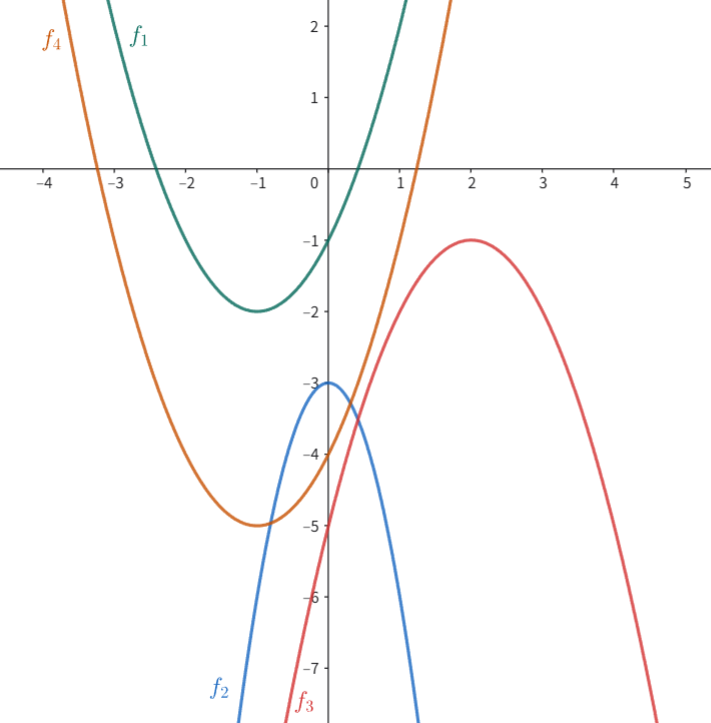

# F. Parabola Independence

**time limit per test:** 3 seconds

**memory limit per test:** 512 megabytes

**input:** standard input

**output:** standard output

You are given a set of $n$ quadratic functions $F=\{f_1,f_2,\ldots,f_n \}$, where $f_i(x)=a_i x^2 + b_i x + c_i$.

Two functions $f$ and $g$ are called independent if $f(x) \neq g(x)$ for all $x \in \mathbb{R}$.

Also, a set of functions $G=\{g_1,g_2,\ldots,g_k\}$ is called organized if the two functions $g_i$ and $g_j$ are independent for all $1 \le i \lt j \le |G|$.

For each $i=1,2,\ldots,n$, please find the size of the largest organized subset of $F$ that contains $f_i$ as an element.

#### Input

Each test contains multiple test cases. The first line contains the number of test cases $t$ ($1 \le t \le 10^4$). The description of the test cases follows.

The first line of each test case contains a single integer $n$ ($1 \le n \le 3000$).

Each of the $n$ following lines contains three integers $a_i$, $b_i$, $c_i$ denoting the function $f_i$ ($-10^6 \le a_i, b_i, c_i \le 10^6$, $a_i \neq 0$).

It is guaranteed that the functions in one test case are pairwise distinct.

It is guaranteed that the sum of $n^2$ over all test cases does not exceed $3000^2$.

#### Output

For each test case, output $n$ integers $s_1,s_2,\ldots,s_n$, where $s_i$ is the size of the largest organized subset that contains $f_i$.

#### Example

#### Input
```
3
4
1 2 -1
-3 0 -3
-1 4 -5
1 2 -4
5
3 0 0
1 0 -5
-3 0 0
-1 0 10
1 0 -10
5
884 -667 497
680 -973 213
23 -548 -412
826 359 -333
773 212 218
```

#### Output
```
3 2 3 3
3 3 2 2 3
3 3 3 1 2
```

#### Note

In the first test case, the functions are as follows:

- $f_1(x)=x^2+2x-1$;
- $f_2(x)=-3x^2-3$;
- $f_3(x)=-x^2+4x-5$;
- $f_4(x)=x^2+2x-4$.

The functions' graphs are as shown below:





The largest organized subsets of $F$ containing each function are as follows:

- $\{f_1,f_3,f_4\}$ is the largest organized subset that contains $f_1$;
- $\{f_1,f_2\}$ is the largest organized subset that contains $f_2$;
- $\{f_1,f_3,f_4\}$ is the largest organized subset that contains $f_3$;
- $\{f_1,f_3,f_4\}$ is the largest organized subset that contains $f_4$.
