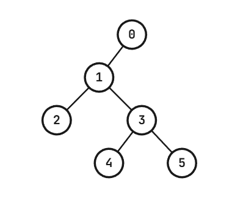

# G. Idiot First Search and Queries

**time limit per test:** 4 seconds

**memory limit per test:** 512 megabytes

**input:** standard input

**output:** standard output

This problem shares the definitions with problem E. However, it does not ask for the same answer.

There is a binary tree of $n+1$ vertices ($n$ is odd), with vertices labeled $0,1,\ldots,n$. At most one letter can be written on each vertex of the tree, and all vertices initially have nothing written on them. The root of the tree is vertex $0$.

In the tree, vertex $0$ is the parent of vertex $1$, while all other vertices have either $2$ children or $0$ children.

Bob is lost in one vertex of the tree and wishes to escape the tree by reaching vertex $0$. This is very easy for most people with common sense. However, since Bob is an idiot, he created a new way of traversing the tree; introducing the "Idiot First Search".

When Bob is on vertex $v$ ($1 \le v \le n$), Bob's movement is determined as follows:

- If vertex $v$ is a leaf, Bob always moves to the parent of $v$; otherwise, check the next few conditions.
- If nothing is written on vertex $v$, Bob writes 'L' on vertex $v$ and moves to the left child of $v$;
- If 'L' is written on vertex $v$, Bob overwrites it to 'R' and moves to the right child of $v$;
- If 'R' is written on vertex $v$, Bob erases it and moves to the parent of $v$.

It takes exactly $1$ second for Bob to move to an adjacent vertex, so Bob will take exactly $x$ seconds to perform $x$ moves.

It has been shown that regardless of which vertex Bob starts on, Bob can reach vertex $0$ in a finite (though possibly inexplicably large) amount of time. We don't know who proved it; surely it can't be Bob, but it is definitely proven.

You are asked to answer $q$ queries of the following kind:

- $v\;k$: Assuming that Bob started from vertex $v$, determine the vertex Bob is on after performing exactly $k$ moves ($1 \le v \le n$).

For each query, let $T_v$ be the time taken to reach vertex $0$ from vertex $v$. Then, it is guaranteed that $k \lt T_v$ for every query.

#### Input

Each test contains multiple test cases. The first line contains the number of test cases $t$ ($1 \le t \le 10^4$). The description of the test cases follows.

The first line of each test case contains integers $n$ and $q$ ($1 \le n \le 300\,001$, $1 \le q \le 400\,000$, $n$ is odd).

Each of the next $n$ lines contains two integers $l_i$ and $r_i$ denoting the children of vertex $i$ ($0 \le l_i,r_i \le n$).

For each vertex, $l_i=r_i=0$ is given if the vertex has no children. Otherwise, $l_i$ and $r_i$ are the left and right children of vertex $i$.

Each of the next $q$ lines contains two integers $v_j$ and $k_j$ denoting the $j$-th query ($1 \le v_j \le n$, $0 \le k_j \color{red}{ \lt } \min(10^9+7,T_{v_j})$).

It is guaranteed that the input defines a valid binary tree satisfying the conditions given in the statement.

It is guaranteed that the sum of $n$ over all test cases does not exceed $300\,001$.

It is guaranteed that the sum of $q$ over all test cases does not exceed $400\,000$.

#### Output

For each test case, output the answers to the $q$ queries on a separate line.

#### Example

#### Input
```
3
1 1
0 0
1 0
5 5
2 3
0 0
4 5
0 0
0 0
3 6
3 8
3 11
4 7
5 8
7 7
2 3
4 5
0 0
6 7
0 0
0 0
0 0
1 9
2 18
3 11
3 12
3 13
5 7
7 17
```

#### Output
```
1
2 3 5 2 1
2 2 1 3 1 2 4
```

#### Note

On the first test case, there are only two vertices, vertex $0$ and vertex $1$. Obviously, Bob will be on vertex $1$ when $0$ moves have been performed after Bob started from vertex $1$.

On the second test case, the tree is given as follows.





It takes $14$ seconds for Bob to reach vertex $0$ from vertex $3$. The moves are as follows:

$$3 \xrightarrow{\mathtt{L}} 4 \xrightarrow{\mathtt{X}} 3 \xrightarrow{\mathtt{R}} 5 \xrightarrow{\mathtt{X}} 3 \xrightarrow{\mathtt{X}} 1 \xrightarrow{\mathtt{L}} \color{red}{2} \xrightarrow{\mathtt{X}} 1 \xrightarrow{\mathtt{R}} \color{red}{3} \xrightarrow{\mathtt{L}} 4 \xrightarrow{\mathtt{X}} 3 \xrightarrow{\mathtt{R}} \color{red}{5} \xrightarrow{\mathtt{X}} 3 \xrightarrow{\mathtt{X}} 1 \xrightarrow{\mathtt{X}} 0$$

Here, the letters above the arrows denote the letter on the vertex before moving to the adjacent vertex, where $\mathtt{X}$ denotes nothing written.

As highlighted in red, it is shown that:

- Bob is on vertex $2$ when $6$ moves have been performed after Bob started on vertex $3$;
- Bob is on vertex $3$ when $8$ moves have been performed after Bob started on vertex $3$;
- Bob is on vertex $5$ when $11$ moves have been performed after Bob started on vertex $3$.
