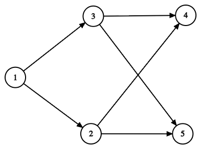

# C2. Interactive Graph (Hard Version)

**time limit per test:** 2 seconds

**memory limit per test:** 256 megabytes

**input:** standard input

**output:** standard output


This is the hard version of the problem. The difference between the versions is that in this version, you can ask no more than $n + m$ questions, and $n \leq 30$. You can hack only if you solved all versions of this problem.

This is an interactive problem.

The jury has thought of a directed acyclic graph without loops and multiple edges, which has $n$ vertices and $m$ edges.

Your task is to determine which edges are in this graph. To do this, you can ask questions of the form: what does the $k$-th path look like in the lexicographically$^{\text{∗}}$ sorted list of all paths in the graph.

A path in the graph is a sequence of vertices $u_{1}, u_{2}, \dots, u_{l}$, such that for any $i \lt l$, there exists an edge ($u_{i}, u_{i + 1}$) in the graph.

Your task is to accomplish this by asking no more than $n + m$ questions.

$^{\text{∗}}$A sequence $a$ is lexicographically smaller than a sequence $b$ if and only if one of the following holds:

- $a$ is a prefix of $b$, but $a \ne b$; or
- in the first position where $a$ and $b$ differ, the sequence $a$ has a smaller element than the corresponding element in $b$.


#### Input

Each test contains multiple test cases. The first line contains the number of test cases $t$ ($1 \le t \le 10$). The description of the test cases follows.

Each test case consists of a single line with an integer $n$ ($1 \le n \le 30$) — the number of vertices in the graph.

The jury guarantees that the given graph does not contain cycles or multiple edges.

Note that $m$ is unknown to you!

#### Interaction

The interaction for each test case begins with reading the integer $n$.

Then you can ask up to $n + m$ questions.

To ask a question, output a string in the format "? k" (without quotes) ($1 \le k \le 2^{30}$). After each question, read an integer $q$ — the number of vertices in the $k$-th path. If $q = 0$, then such a path does not exist; otherwise, read $q$ integers — the vertex numbers that make up this path.

To report your answer, first output a string in the format "! m", and then output $m$ lines describing the edges in the format "u v", which means that there is an edge leading from $u$ to $v$. You can output the edges in any order. Outputting the answer does not count as a query.

It can be shown that under the given constraints, the number of distinct paths in the graph does not exceed $2^{30}$.

After printing each query do not forget to output the end of line and flush$^{\text{∗}}$ the output. Otherwise, you will get Idleness limit exceeded verdict.

If, at any interaction step, you read $-1$ instead of valid data, your solution must exit immediately. This means that your solution will receive Wrong answer because of an invalid query or any other mistake. Failing to exit can result in an arbitrary verdict because your solution will continue to read from a closed stream.

Hacks:

For hacks, use the following format:

The first line should contain a single integer $t$ ($1\leq t\leq 10$) — the number of test cases.

The first line of each case should contain two integers $n, m$ ($1 \leq n \leq 30$, $0 \leq m \leq \frac{n \cdot (n - 1)}{2}$) — the number of vertices and edges in the graph.

The next $m$ lines should contain descriptions of the edges. Each edge is defined by two integers $v$, $u$ ($1 \leq v, u \leq n$, $v \neq u$), meaning an edge from vertex $v$ to vertex $u$.

The graph cannot contain cycles or multiple edges.

$^{\text{∗}}$To flush, use:

- fflush(stdout) or cout.flush() in C++;
- sys.stdout.flush() in Python;
- see the documentation for other languages.

#### Example

#### Input
```
3
5

1 1

2 1 2

3 1 2 4

3 1 2 5

2 1 3

3 1 3 4

3 1 3 5

1 2

1 3

1 4

1 5

1

0

2

1 1

1 2

2 2 1
```

#### Output
```
? 1

? 2

? 3

? 4

? 5

? 6

? 7

? 8

? 11

? 14

? 15

! 6
1 3
1 2
2 4
3 4
2 5
3 5

? 2

! 0

? 1

? 2

? 3

! 1
2 1
```

#### Note

The graph for the first test case.





In this graph, there are $15$ paths, which are arranged in lexicographic order as follows:

- $1$
- $1 \to 2$
- $1 \to 2 \to 4$
- $1 \to 2 \to 5$
- $1 \to 3$
- $1 \to 3 \to 4$
- $1 \to 3 \to 5$
- $2$
- $2 \to 4$
- $2 \to 5$
- $3$
- $3 \to 4$
- $3 \to 5$
- $4$
- $5$
