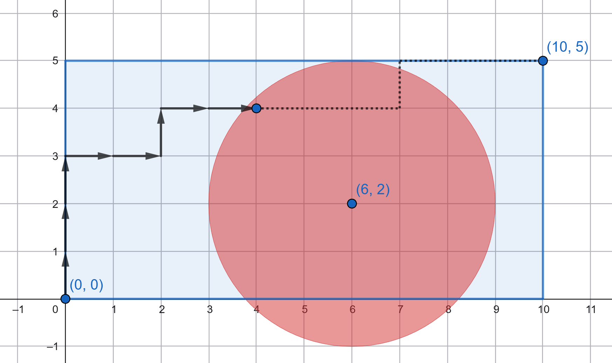

# G. Jammer

**time limit per test:** 2 seconds

**memory limit per test:** 512 megabytes

**input:** standard input

**output:** standard output

On a field of size $n \times m$, there is a robot located at point $(0, 0)$, whose task is to reach point $(n, m)$. The robot moves in steps: at each step, it can move one unit to the right or one unit up. In other words, if it is currently at point $(i, j)$, it can move to either $(i + 1, j)$ or $(i, j + 1)$ in one step.

You do not know the exact route of the robot, but you need to intercept it. For this purpose, you have a jammer with power $r$, which you can place at any integer point $(x, y)$ on the field ($0 \le x \le n$; $0 \le y \le m$).

The robot is considered to be intercepted if at some point during its movement it is within a distance of no more than $r$ from the jammer. In other words, if there exists a point $(i, j)$ on the robot's path such that $\sqrt{(i - x)^2 + (j - y)^2} \le r$.





But there is a problem: if you place the jammer too close to the starting or the ending point of the robot's route, it will be noticed, and your plan will be compromised. Thus, you want to position the jammer so that it covers neither the point $(0, 0)$ nor the point $(n, m)$ (i. e., the distance to each of them must be strictly greater than $r$).

Calculate the number of suitable points for placing the jammer. A point is suitable if it is not too close to the ends of the route, but at the same time, the robot will be intercepted regardless of the route it takes.

#### Input

The first line contains one integer $t$ ($1 \le t \le 100$) — the number of test cases. The following are the $t$ test cases.

The first and only line of each test case contains three integers $n$, $m$, and $r$ ($n, m \ge 1$; $n \cdot m \le 10^9$; $1 \le r \le n + m$) — the dimensions of the field and the power of the jammer.

#### Output

For each test case, output a single integer — the number of points suitable for placing the jammer.

#### Example

#### Input
```
6
1 1 1
10 5 3
3 6 3
4 2 3
1000000000 1 2
1 1000000000 499999999
```

#### Output
```
0
16
6
0
1999999992
4
```

#### Note

One possible placement of the jammer for the second test case is illustrated in the statement.
