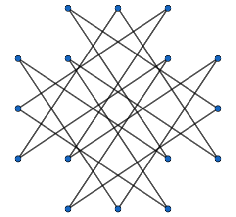

# G. Codeforces Heuristic Contest 1001

**time limit per test:** 9 seconds

**memory limit per test:** 1001 megabytes

**input:** standard input

**output:** standard output

There is a graph of $n^2$ vertices, where vertices are labeled by integer pairs $(r,c)$ such that $1 \le r,c \le n$. Vertices $(r_1,c_1)$ and $(r_2,c_2)$ are directly connected if and only if $(r_1-r_2)^2+(c_1-c_2)^2=\color{red}{13}$. This graph is called the Zebra Graph of dimensions $n \times n$.

Please find a subset of vertices $S$ in the Zebra Graph of dimensions $n \times n$, which satisfies the following condition.

- The graph induced$^{\text{∗}}$ by the subset $S$ is isomorphic to a cycle graph of at least $\left\lfloor{\frac{n^2}{e}}\right\rfloor$ vertices$^{\text{†}}$.

It can be shown that such a subset of vertices exists under the constraints of this problem.

$^{\text{∗}}$The induced graph of a subset of vertices $X$ is a graph that contains all vertices in $X$ and all edges whose both endpoints are in $X$.

$^{\text{†}}$Here, $e$ is the mathematical constant equal to the limit $\lim \limits_{n \to \infty} \left ({1 + \frac{1}{n}} \right )^n \approx 2.71828182$. Note that the value of $\frac{1}{e}$ is approximately $0.36787944$.

#### Input

The first and only line of input contains a single integer $n$ ($n\in \{5,1001\}$).

There are only two input files for this problem:

- The first input file (the example input) has $n=5$;
- The second input file has $n=1001$.

Hacks are disabled for this problem.

#### Output

Output $n$ lines, each containing a string $s_i$ of length $n$ denoting the $i$-th row of the graph. If the vertex $(r,c)$ is an element of $S$, then the $c$-th letter of $s_r$ should be '1'. Otherwise, the $c$-th letter of $s_r$ should be '0'.

If there are multiple solutions, print any of them.

#### Example

#### Input
```
5
```

#### Output
```
01110
11011
10001
11011
01110
```

#### Note

For the example output, the induced graph corresponding to the subset $S$ is shown below.





This graph is isomorphic to the cycle graph $C_{16}$ consisting of $16$ vertices. As $16 \ge \left\lfloor{\frac{n^2}{e}}\right\rfloor = 9$, the output satisfies the problem's condition.
