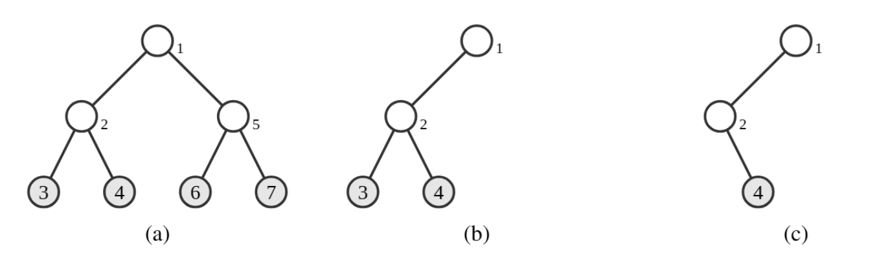
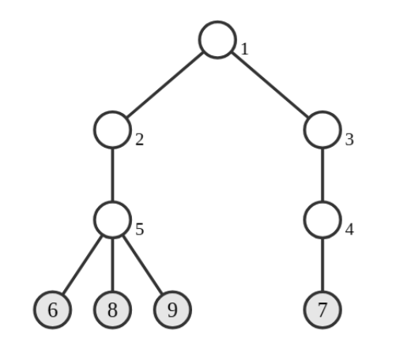

# B. Subtree Removal Game

**time limit per test:** 3 seconds

**memory limit per test:** 1024 megabytes

**input:** standard input

**output:** standard output

You are given a rooted tree with $n$ nodes, numbered from $1$ to $n$, rooted at node $1$. For each node $i$ ($2 \le i \le n$), its parent is node $p_i$. For each node $i$, if it is a leaf (a node having no children), the integer $i$ is written on it. Otherwise, nothing is written.

Node $u$ is a descendant of node $v$ if $u = v$, or $u$ is not the root and the parent of $u$ is a descendant of $v$.

Now, you and your friend play a game on this tree, taking turns alternately: You move first, then your friend, and so on. On each turn, the current player must choose a node $v$ and then remove the entire subtree of $v$ (i.e., all descendants of $v$, including $v$ itself). The move is allowed only if, after the removal, at least one node with an integer written on it remains in the tree.

The game ends when no further moves are possible. At that point, exactly one node with an integer written on it remains; the score of the game is the integer on that node.

You aim to minimize the score, while your friend aims to maximize it. Assuming you and your friend play optimally, determine the score of the game.

#### Input

The first line of input contains an integer $n$ ($2 \le n \le 500\,000$).

The second line contains $n-1$ integers $p_2, p_3, \ldots, p_n$ ($1 \le p_i \lt i$ for all $2 \le i \le n$).

#### Output

Output the score of the game assuming you and your friend play optimally.

#### Examples

#### Input
```
7
1 2 2 1 5 5
```

#### Output
```
4
```

#### Input
```
9
1 1 3 2 5 4 5 5
```

#### Output
```
7
```

#### Note

Explanation for the sample input/output #1

The given tree is illustrated in Figure B.1 (a).




Figure B.1: Illustration of Sample Input #1.
The only optimal moves for both players are as follows:

- You choose node $5$. Then nodes $5$, $6$, and $7$ are removed (Figure B.1 (b)).
- Your friend chooses node $3$. Then only node $3$ is removed (Figure B.1 (c)).
- You cannot make any moves, and the game ends.
 After these moves, only one node with an integer written on it, node $4$, remains. The score of this game is $4$.
Explanation for the sample input/output #2

The given tree is illustrated in Figure B.2. One of the optimal moves for you is to choose node $2$. The game ends after that, and the score is $7$.




Figure B.2: Illustration of Sample Input #2.
