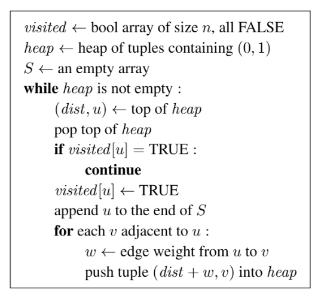
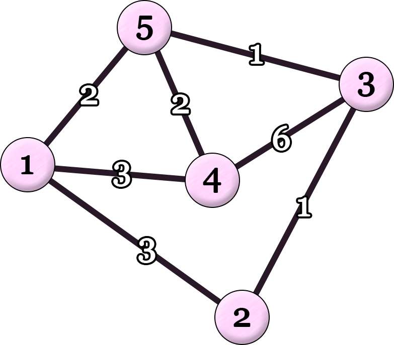

# C. Upside Down Dijkstra

**time limit per test:** 2 seconds

**memory limit per test:** 1024 megabytes

**input:** standard input

**output:** standard output

 Your little sibling has a connected undirected graph of $n$ vertices and $m$ edges. The vertices are numbered from $1$ to $n$, and the edges are numbered from $1$ to $m$. Edge $j$ connects vertices $u_j$ and $v_j$ with a positive integer weight of $w_j$.

 Your little sibling coded Dijkstra's algorithm to find the shortest distances from vertex $1$ to all other vertices, as shown in the pseudocode below. The array $S$ records the order in which each vertex is popped from the heap for the first time. Note that even though tuples for each vertex may be pushed multiple times into the heap, each vertex is added to $S$ exactly once.

 However, your little sibling made a big mistake. In your sibling's code, the heap always pops the maximum tuple instead of the minimum tuple. Here, the heap orders tuples lexicographically by $(\mathit{dist}, u)$, with larger $\mathit{dist}$ considered larger; ties are broken by larger $u$.





Your little sibling shares the graph structure with you, that is, all pairs of $u_j$ and $v_j$ ($1 \le j \le m$). However, your sibling does not share the edge weights $w_j$. Instead, your sibling shares an array $S = (s_1, s_2, \ldots, s_n)$ with you and asks you to reconstruct the edge weights. Your task is to find integer edge weights $w_1, w_2, \ldots, w_m$ ($1 \leq w_j \leq 10^9$ for all $j$) such that running your sibling's incorrect code yields the given array $S$.

Find any such assignment of edge weights. If no such assignment exists, report that it is impossible.

#### Input

The first line of input contains two integers $n$ and $m$ ($2 \leq n \leq 100\,000$; $n-1 \leq m \leq 200\,000$).

The $j$-th of the next $m$ lines contains two integers $u_j$ and $v_j$ ($1 \leq u_j \lt v_j \leq n$; $(u_j, v_j) \neq (u_k, v_k)$ for all $j \neq k$). The input guarantees that the graph is connected.

The next line contains $n$ integers $s_1, s_2, \ldots, s_n$ ($1 \leq s_i \leq n$; $s_i \neq s_\ell$ for all $i \neq \ell$).

#### Output

If no assignment of edge weights yields the given array $S$, output impossible.

Otherwise, output a single line containing $m$ integers $w_1, w_2, \ldots, w_m$ ($1 \leq w_j \leq 10^9$) for the weights of the edges such that your sibling's incorrect code yields the given array $S$.

If there are multiple outputs, any one of them will be accepted.

It can be shown that if there exists any assignment of positive integer weights that yields $S$, then there also exists one with $1 \le w_j \le 10^9$ for all $j$.

#### Examples

#### Input
```
5 7
3 4
2 3
1 2
3 5
1 4
1 5
4 5
1 4 3 5 2
```

#### Output
```
6 1 3 1 3 2 2
```

#### Input
```
4 4
1 2
2 3
1 3
2 4
1 3 4 2
```

#### Output
```
impossible
```

#### Note

Explanation for the sample input/output #1

Figure C.1 illustrates the structure of the graph and the assignment of edge weights in the sample output.




Figure C.1: Graph with assigned edge weights.
With this assignment, your sibling's incorrect code runs as follows:

- Initially, the heap contains $\{(0, 1)\}$.
- From $(0, 1)$, vertex $1$ is popped from the heap for the first time. Now the heap contains $\{(3, 4), (3, 2), (2, 5)\}$.
- From $(3, 4)$, vertex $4$ is popped. Now the heap contains $\{(9, 3), (6, 1), (5, 5), (3, 2), (2, 5)\}$.
- From $(9, 3)$, vertex $3$ is popped. Now the heap contains $\{(15, 4), (10, 5), (10, 2), (6, 1), (5, 5), (3, 2), (2, 5)\}$.
- From $(10, 5)$, vertex $5$ is popped. Now the heap contains $\{(12, 4), (12, 1), (11, 3), (10, 2), (6, 1), (5, 5), (3, 2), (2, 5)\}$.
- From $(10, 2)$, vertex $2$ is popped.

This results in $S = (1, 4, 3, 5, 2)$.
