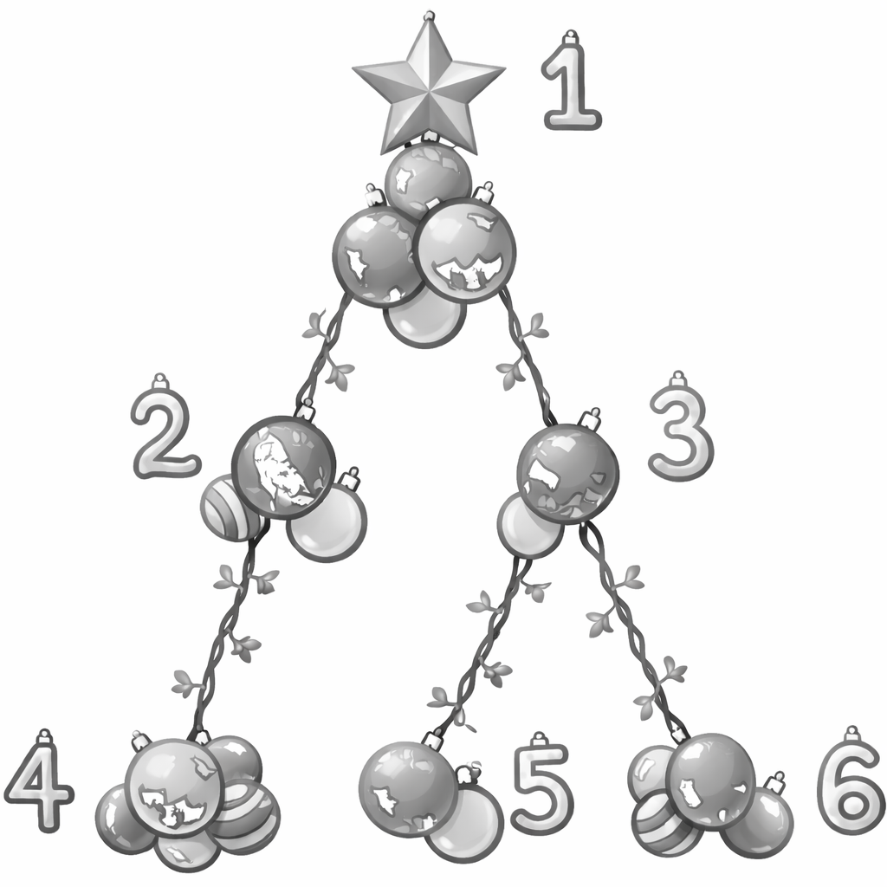

# D. Christmas Tree Un-decoration

**time limit per test:** 3 seconds

**memory limit per test:** 1024 megabytes

**input:** standard input

**output:** standard output




Figure D.1: Christmas tree.
Last Christmas, you had a lovely Christmas tree with $n$ vertices, numbered from $1$ to $n$ and rooted at vertex $1$. For each $i$ ($2 \le i \le n$), vertex $p_i$ is the parent of vertex $i$. The tree is decorated beautifully with $a_i$ ornaments on vertex $i$ ($1 \le i \le n$).

However, it has already been a few months since Christmas, and it is time to take down all the ornaments and put your tree away until next year. Since this process is tedious, you have decided to make it more fun by using only the following operation, which you can perform zero or more times:

Choose a vertex $u$. For each vertex $v$ on the unique simple path from vertex $1$ to vertex $u$ (inclusive), remove exactly one ornament from $v$ if there is any left.

While you are still determining the minimum number of operations needed, your little child modifies the number of ornaments on the tree. More precisely, your child makes $q$ changes. In the $j$-th change, the number of ornaments on vertex $u_j$ is modified to $x_j$ ($1 \le j \le q$). Note that these changes are persistent; the effect of each change carries over to subsequent changes.

Note that you do not actually perform any operations on the tree.

For the initial configuration and after each change, your task is to determine the minimum number of operations needed to remove all the ornaments from the tree at each moment.

#### Input

The first line of input contains one integer $t$ ($1 \le t \le 10\,000$) representing the number of test cases. After that, $t$ test cases follow. Each of them is presented as follows.

The first line of each test case contains two integers $n$ and $q$ ($2 \le n \le 200\,000$; $1 \le q \le 200\,000$). The second line contains $n-1$ integers $p_2, p_3, \ldots, p_n$ ($1 \le p_i \lt i$ for all $2 \le i \le n$). The third line contains $n$ integers $a_1, a_2, \ldots, a_n$ ($1 \le a_i \le 10^9$ for all $1 \le i \le n$).

The $j$-th of the next $q$ lines contains two integers $u_j$ and $x_j$ ($1 \le u_j \le n$; $1 \le x_j \le 10^9$).

The sum of $n$ across all test cases in one input file does not exceed $200\,000$.

The sum of $q$ across all test cases in one input file does not exceed $200\,000$.

#### Output

For each test case, output $q+1$ lines. The first line should contain the minimum number of operations required for the initial tree. The $j$-th of the following $q$ lines should contain the minimum number of operations required after the $j$-th change happens.

#### Example

#### Input
```
2
6 3
1 1 2 3 3
5 3 2 5 2 4
4 1
3 10
1 6
8 6
1 2 3 4 5 5 3
1 1 1 1 1 1 1 1
6 3
8 3
5 5
6 1
3 7
5 1
```

#### Output
```
11
9
13
13
3
5
7
8
8
8
7
```

#### Note

Explanation for the sample input/output #1

For the first test case, its initial tree is illustrated in Figure D.1. Note that the star at vertex $1$ in the figure is also an ornament.

- In the initial tree, you can remove all ornaments with $11$ operations by choosing vertex $4$ five times, vertex $5$ twice, and vertex $6$ four times.
- After the first change, there is only one ornament on vertex $4$. You need $9$ operations; choose vertex $4$ once, vertex $2$ twice, vertex $5$ twice, and vertex $6$ four times.
- After the second change, there are ten ornaments on vertex $3$. You need $13$ operations.
- After the third change, there are six ornaments on vertex $1$. However, the required number of operations is unchanged.
