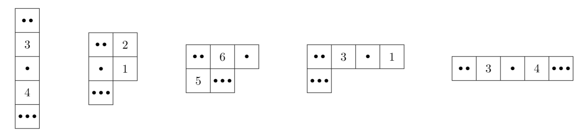

# F. Minesweeper String

**time limit per test:** 3 seconds

**memory limit per test:** 1024 megabytes

**input:** standard input

**output:** standard output

You are given a string $S$ of length $n$ consisting of digits 0–9. You want to use this string to generate a variant of Minesweeper. In this variant, a cell may contain more than one mine, and the mine count in a cell is based on its 4-neighborhood (edge-adjacent cells), instead of the usual 8-neighborhood.

To do that, you choose an integer $w$ ($1 \le w \le n$) representing the width of the grid. You arrange the $n$ cells, numbered from $0$ to $n-1$, into a grid. The grid has $\left\lceil n / w \right\rceil$ rows numbered from $0$ to $\left\lceil n / w \right\rceil-1$ from top to bottom, and $w$ columns numbered from $0$ to $w-1$ from left to right. For each $0 \leq i \lt n$, cell $i$ is located at row $\left\lfloor i/w \right\rfloor$ and column $i \bmod w$, and corresponds to the $(i+1)$-th digit of $S$. Thus, row $0$ contains cells $0$ to $w-1$, row $1$ contains cells $w$ to $2w-1$, and so on. Note that the bottommost row may contain less than $w$ cells.

After arranging the grid, you perform the following steps:

- For each cell corresponding to a non-zero digit $x$ (1–9), you place $x$ mines in that cell.
- For each remaining cell corresponding to 0, you write a number in that cell that is equal to the total number of mines in its adjacent cells. Two cells are adjacent if they share an edge. Note that each cell has at most four adjacent cells.

For a width $w$, define $f(w)$ as the sum of the numbers in all cells without mines on the generated grid. Given an integer $k$, your task is to compute the $k$-th largest value among the values $f(1), f(2), \ldots, f(n)$.

#### Input

The first line of input contains two integers $n$ and $k$ ($1\leq k \leq n \leq 500\,000$).

The second line contains a string $S$ of length $n$ consisting of digits 0–9.

#### Output

Output the $k$-th largest value among $f(1), f(2), \ldots, f(n)$.

#### Examples

#### Input
```
5 3
20103
```

#### Output
```
7
```

#### Input
```
5 1
20103
```

#### Output
```
11
```

#### Input
```
8 4
60409003
```

#### Output
```
35
```

#### Note

Explanation for the sample input/output #1

Figure F.1 illustrates the resulting grids for widths $1$ to $5$. Each dot in a cell represents one mine.




Figure F.1: The resulting grids for all $5$ possible widths.
By summing up the numbers on the cells containing no mines, you obtain the following.

- $f(1) = 7$
- $f(2) = 3$
- $f(3) = 11$
- $f(4) = 4$
- $f(5) = 7$

The third largest value among them is $7$.
