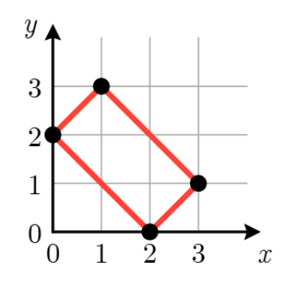
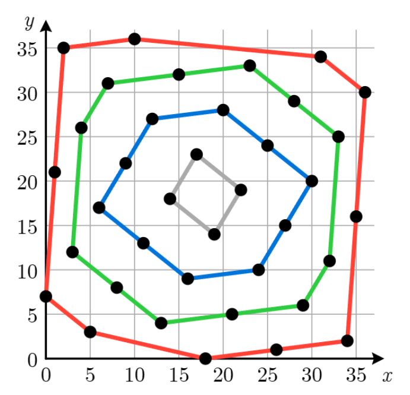

# L. Onion

**time limit per test:** 10 seconds

**memory limit per test:** 1024 megabytes

**input:** standard input

**output:** standard output

Onions are widely used in cuisines around the world. This problem is about an "onion peeling" process in geometry.

A set of points in a two-dimensional plane is convex if, for any pair of points $p$ and $q$ in the set, the line segment connecting $p$ and $q$ is entirely contained in the set. For a set of points $S$, its convex hull is the smallest convex set containing all points in $S$.

You are given four integers $n$, $a$, $b$, and $k$. You have a set $S$ of $n$ points, initialized as follows: $$ S = \{ (x, (ax + b) \bmod n) \mid x = 0, 1, \ldots, n-1 \}. $$

You apply the following operation $k$ times: let $H$ be the convex hull of the set $S$, and then remove from $S$ all points that lie on the boundary of the convex hull $H$.

Note that $S$ can become empty. In that case, its convex hull is also empty, and its area is zero.

For each operation, determine the doubled area of the convex hull $H$. It can be shown that this value is always an integer.

#### Input

The input consists of a single line containing four integers $n$, $a$, $b$, and $k$ ($1 \le n \le 10^9$; $0 \le a, b \lt n$; $1 \le k \le 300$).

#### Output

Output $k$ lines. The $i$-th line should contain an integer representing the doubled area of the convex hull in the $i$-th operation.

#### Examples

#### Input
```
4 1 2 1
```

#### Output
```
8
```

#### Input
```
37 14 7 5
```

#### Output
```
2257
1406
592
74
0
```

#### Input
```
280 40 12 4
```

#### Output
```
131040
82880
39200
0
```

#### Note

Explanation for the sample input/output #1

Figure L.1 illustrates the points in $S$ and the boundary of the convex hull in the first operation. The area of the convex hull is $4$, and thus the doubled area is $8$.




Figure L.1: Illustration of Sample Input #1.
Explanation for the sample input/output #2

Figure L.2 illustrates the boundaries in the first four operations. The set $S$ becomes empty after the fourth operation. The area for the fifth operation is $0$.




Figure L.2: Illustration of Sample Input #2.
